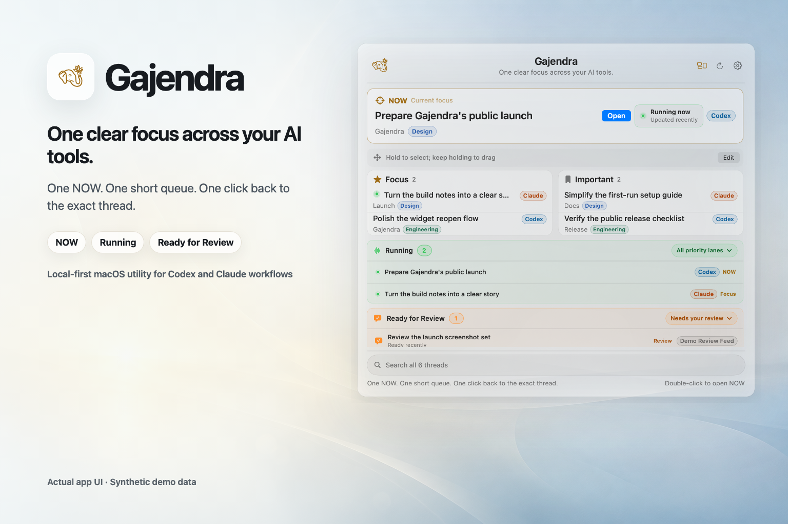
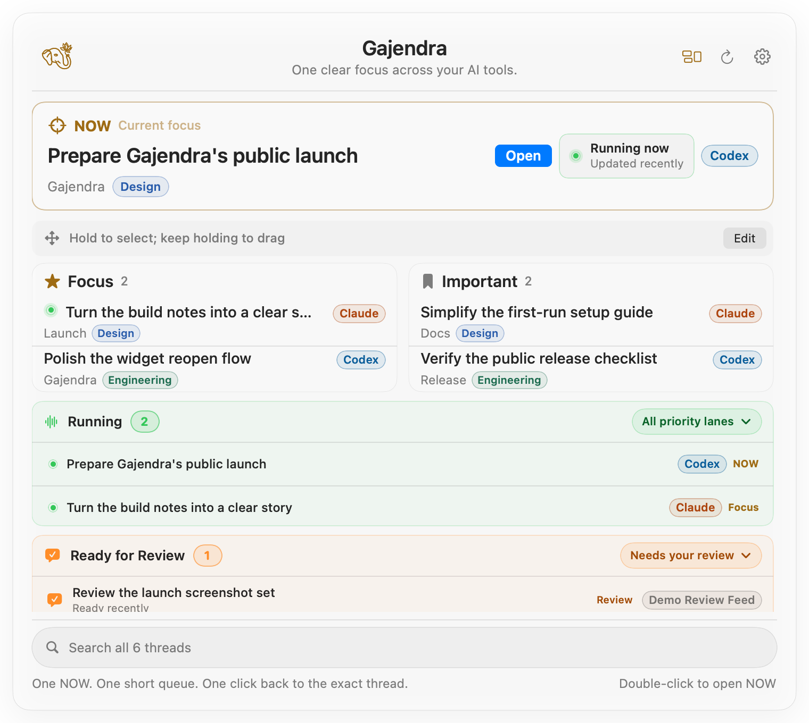
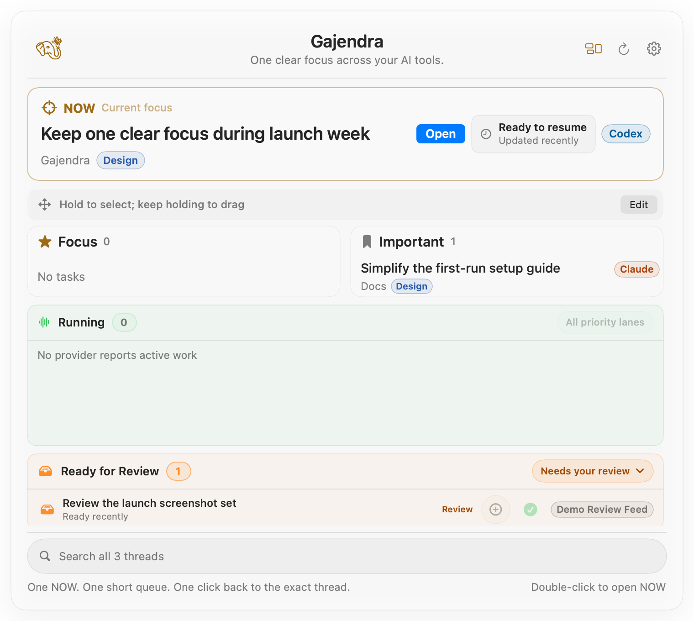
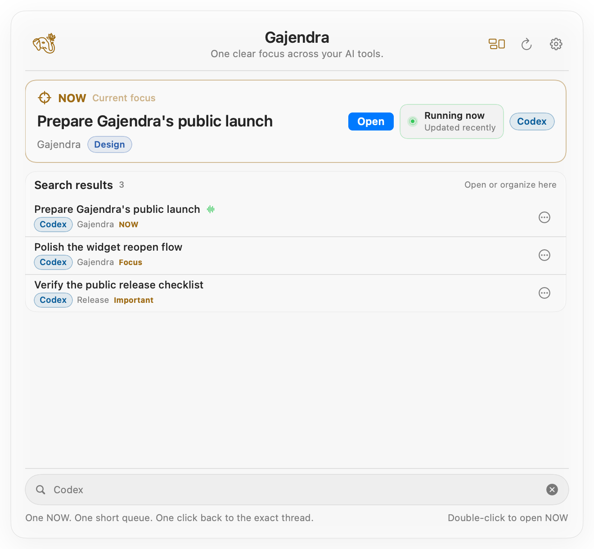
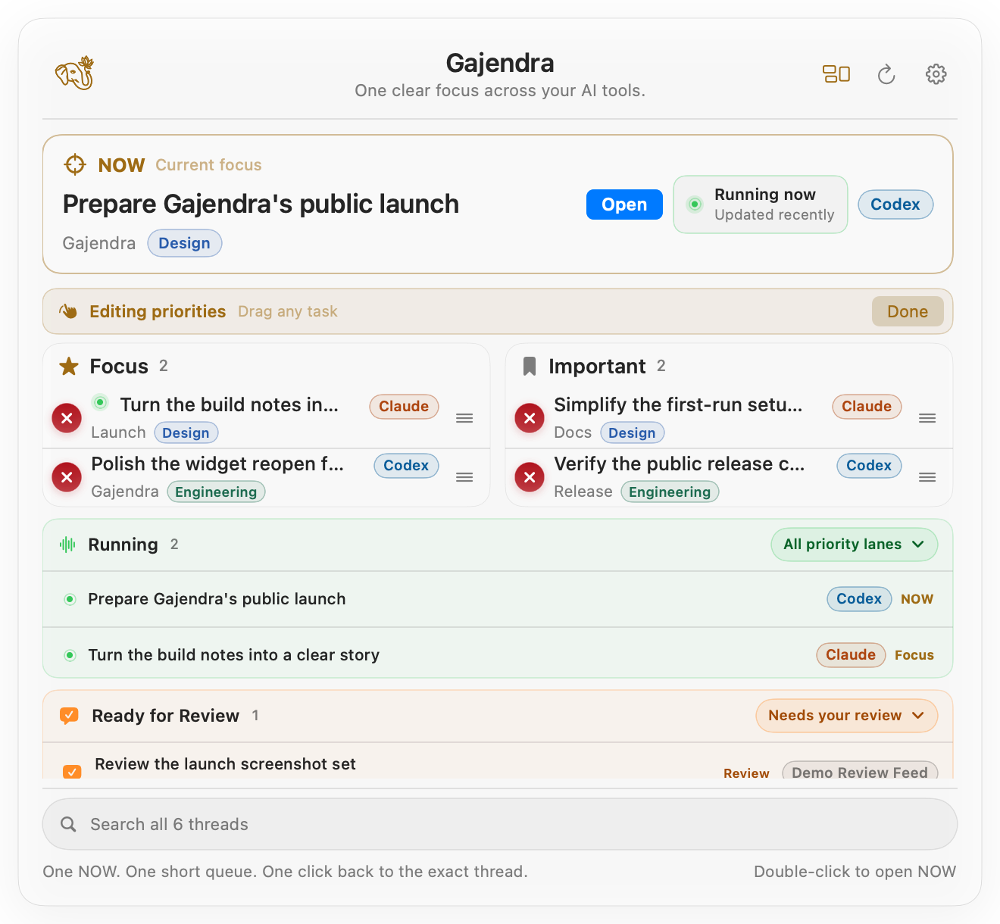
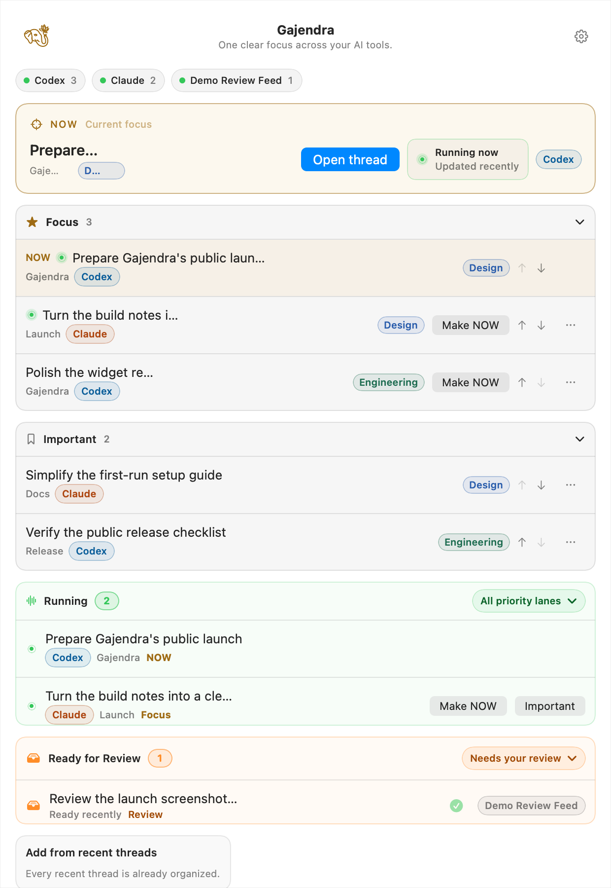

# Gajendra

<p align="center">
  
</p>

<p align="center"><strong>One clear focus across your AI tools.</strong><br />
One NOW. One short queue. One click back to the exact thread.</p>



Gajendra is a local-first macOS focus utility for AI-agent threads. It gives you one place to decide
what deserves attention across Codex, Claude Code, and other explicitly enabled local sources—then
returns you to the owning tool when it is time to work.

It does not replace those tools or copy their conversations. It adds a small, quiet attention layer
above them.

## Why Gajendra exists

AI work rarely stays inside one session. A coding task may still be running in Codex, a writing task
may be waiting in Claude, and a finished result may need review somewhere else. The sessions exist;
the missing piece is a trusted answer to four simple questions:

- What am I doing **NOW**?
- What are the few things I should return to next?
- What is still **Running**?
- What is **Ready for Review**?

Gajendra keeps those answers close without becoming another project-management system.

## Product tour

These are deterministic screenshots of the real SwiftUI views. Every title, project, ID, and status
comes from a public synthetic fixture shaped like common Codex and Claude workflows; no private
thread content is used.

| Focus overview | Ready for Review |
| --- | --- |
|  |  |

| Search | Edit priorities |
| --- | --- |
|  |  |



## What you can do

| Capability | What it is for |
| --- | --- |
| **NOW** | Keep exactly one current thread visible and open it immediately. Double-click anywhere on the NOW card or select **Open**; NOW always belongs to Focus. |
| **Focus and Important** | Maintain short ordered queues. A quick click opens; hold a card task to select and lift it, then keep dragging the visible row to reorder or change lanes. Compact rows stay focused on thread metadata instead of showing a permanent drag/menu handle. Organizer retains explicit queue controls. |
| **Running** | See provider-reported active work across every priority lane. Its highlighted count stays visible; click **All priority lanes** or double-click the dock header to shrink or expand the list. It is live status, not a guessed priority or a recency label. |
| **Ready for Review** | See a proven completed result awaiting your next input and open its exact Review or Task destination. Opening does not mark it handled; a newer provider turn changes the live signal. Its highlighted count stays visible, and Running takes precedence. |
| **Search** | Filter local title, project, provider, context/tag, priority, Running, and Ready metadata without copying conversation bodies. |
| **Open and resume** | Return to the source-owned thread with source-specific destination validation. |
| **Edit and recover** | Reorder, move, append, remove, make NOW, and use app-owned Undo/Redo after successful changes. |
| **Adapt the surface** | Choose compact, comfortable, or expanded cards; light, dark, or system appearance; native or Focus Deck styling; and a preferred screen position. |
| **Open quickly** | The floating launcher, Dock reopen, and menu-bar item lead to the compact focus card. Organizer remains an explicit management destination. The card is prebuilt before first use, becomes pointer-ready on reveal, and queues a fresh read even when launch loading is still finishing. |
| **Start quietly** | Choose sources on first launch and enable Launch at Login only through an explicit action. |

Built-in Codex, Claude Code, Cursor, and Grok adapters provide bounded thread metadata. The current
local Codex app-server can additionally supply a zero-message newest-turn summary: Gajendra maps
only a valid terminal `completed` turn to Ready for Review and fails closed when that experimental
metadata method is absent or ambiguous. Claude Code, Cursor, and Grok are never guessed ready from
idle time, recency, or resumability. An explicitly configured bounded catalog can also supply a
validated live review signal.

## Set it up on macOS

### Requirements

- macOS **13.5 or later**
- Xcode or the Xcode Command Line Tools
- Node.js **20 or later** for the source build
- At least one supported local AI tool whose threads you want to see

### Build and open the app

```sh
git clone https://github.com/siddath/Gajendra.git gajendra
cd gajendra
npm ci
npm run companion:build
open build/Gajendra.app
```

The first build downloads and checksum-verifies the pinned Node runtime used inside the app bundle.
The running app uses that bundled runtime; it does not depend on Homebrew or a separately installed
Node binary.

### Choose your sources

1. On first launch, keep the local sources you want enabled.
2. Codex uses its local app-server when available. Claude Code metadata is **opt-in**.
3. Select **Done**, then single-click the floating elephant-and-lotus button to show or hide the
   focus card.
4. Open **Settings → Manage AI tools…** later to change sources or rescan them.

For the full daily workflow, interaction reference, configured review example, and troubleshooting,
read the [user guide](docs/USER_GUIDE.md).

To verify the real floating window with privacy-safe synthetic tasks, run `npm run
companion:ui-test`. `npm run companion:ui-performance-test` separately enforces the measured
launcher budget and checks the widget journey for SwiftUI dependency cycles.

### Optional: add the Codex plugin

If you also want Gajendra's MCP tools inside Codex, with the Codex CLI available locally:

```sh
npm run install:local
```

This installs the local plugin from the checked-out source. It is separate from opening the macOS
companion.

## Local-first privacy

- Provider products continue to own sessions, credentials, prompts, transcripts, and source files.
- Gajendra persists only namespaced thread IDs, priority order, the bounded context enum, source
  preferences, revision data, and bounded idempotency receipts.
- It does **not** persist thread titles, prompts, transcript bodies, tokens, credentials, review
  results, diffs, or arbitrary provider responses.
- Every source is explicit and bounded. There is no arbitrary filesystem crawl or shell discovery.
- Open actions revalidate source-specific URL schemes immediately before launch.

The private default state path is:

```text
~/Library/Application Support/Gajendra/gajendra.v2.json
```

See [Security](SECURITY.md) and [thread-source boundaries](docs/THREAD_SOURCES.md) for the complete
contract.

## Verify a checkout

```sh
npm run check
npm run test:e2e
npm run companion:test
npm run companion:build
npm run companion:ui-test
npm run companion:validate
npm run companion:bundle-readiness
```

Regenerate the public synthetic screenshot suite and screenshot-led hero with:

```sh
npm run launch:assets
npm run validate:launch-assets
```

The repository's current evidence and remaining release gates are recorded in [Status](STATUS.md)
and the [release checklist](docs/RELEASE_CHECKLIST.md).

## Release boundary

The source repository is public and the current local candidate has source, browser, native,
real-window launcher, bundle, and local-gauntlet receipts. There is no downloadable release claimed
here: the app has not yet completed Developer ID signing, notarization, stapling, Gatekeeper, and
clean-Mac distribution proof. Build from source if you want to try it today.

The retained mobile work is a documentation-only protocol and security plan, not a shipped iOS or
Android companion. See the [mobile plan](worksheets/GAJENDRA_MOBILE_APP_PLAN.md).

## Project guides

- [User guide](docs/USER_GUIDE.md)
- [Architecture](docs/ARCHITECTURE.md)
- [macOS companion contract](docs/COMPANION.md)
- [Thread sources](docs/THREAD_SOURCES.md)
- [Compatibility](docs/COMPATIBILITY.md)
- [Release checklist](docs/RELEASE_CHECKLIST.md)
- [Support](SUPPORT.md)

Use [GitHub Discussions](https://github.com/siddath/Gajendra/discussions) for support and
[private security reporting](https://github.com/siddath/Gajendra/security/advisories/new) for
vulnerabilities.
