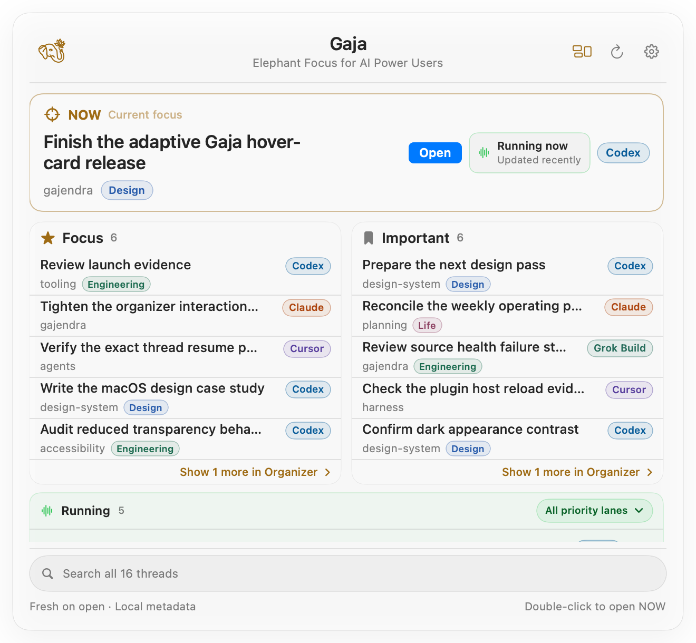

# Gajendra

<p align="center">
  
</p>

<p align="center">
  <a href="https://github.com/siddath/Gajendra/actions/workflows/ci.yml"></a>
  <a href="LICENSE"></a>
  
</p>

**Gaja, Elephant Focus for AI Power Users** is an open-source, local-first macOS focus utility for AI-agent threads. It gives Codex, Claude Code, Cursor, Grok Build, and explicitly configured agents one shared priority layer: one **NOW**, an ordered Focus queue, and an Important tier.

The repository and compatibility identity is **Gajendra** (`gajendra` in packages, plugin IDs, URLs, bundle identifiers, and state paths). The user-facing product is **Gaja**. Keeping that boundary avoids breaking existing installations and priority state.

The daily surface is an icon-only outline of an elephant lifting its trunk to hold a lotus, defaulting to the bottom right. Click it to show or hide the current thread, its explicit provider activity state, the short priority lanes, and every thread a provider reports as running - even when that thread is also NOW, Focus, or Important. Hover only highlights the launcher, so incidental pointer crossings never open the card. The card stays open for interaction until another launcher click, an outside click, or Escape. Running expands into a complete active-thread list inside one vertically scrollable card body, so Compact remains useful with several simultaneous tasks. A full-width search capsule stays pinned below that body and finds or reprioritizes any loaded thread without leaving the card. Choose **Open** or the provider badge to resume that exact thread in the owning agent.

Choose Top Left, Top Right, Center, Bottom Left, Bottom Center, or Bottom Right from the trailing Settings gear or from the app menu. Settings also owns theme, Auto/Light/Dark appearance, and Compact/Comfortable/Expanded card size; opening it never changes a preference. Double-click the floating mark to enter or leave edit mode, then drag it toward a hotspot or use the jiggling X to hide it. Micro-drags are ignored, an intentional drag snaps to the nearest hotspot, and the card closes while the mark moves. The card opens inward above, below, or beside the launcher instead of covering it. Secondary-click or Control-click the floating mark for its contextual menu, including a confirmed **Uninstall Gaja…** command that retains local priority metadata. A resizable drag-and-drop organizer remains available from the card, Dock, menu bar, or `⇧⌘O`.

> “Widget” describes the compact experience. The current release is a native AppKit/SwiftUI floating utility, not a WidgetKit extension. WidgetKit cannot implement this cross-application, always-on-top interactive card.



## Why Gaja

AI tools own their sessions; Gaja owns only the decision about what matters next. It does not replace the source apps, copy conversations into a new task system, or modify their private databases.

- Exactly one global NOW, and it must be in Focus.
- One resume action back to Codex, Claude Code, Cursor, Grok Build, or a configured agent.
- A derived Running view across every priority lane for threads whose provider explicitly reports active work; placement labels disambiguate duplicates, while resumable or recent metadata is never promoted by inference.
- Optional Design, Engineering, or Life context on prioritized threads, visible at a glance and editable without copying provider content.
- Source health and opt-in controls in the organizer.
- Owner-only, metadata-only local persistence.
- Native light/dark appearance, Reduce Motion support, keyboard commands, and VoiceOver labels.

## Thread sources

| Source | Discovery | Resume | Default | Current proof |
| --- | --- | --- | --- | --- |
| Codex | Local `codex app-server` | Native `codex://threads/...` link | On | Live local integration |
| Claude Code | Documented local session JSONL metadata | `claude --resume <session-id>` in Terminal | Off, explicit opt-in | Parser tests and local adapter validation |
| Cursor | Official `cursor-agent ls` | `cursor-agent --resume=<chat-id>` | On | Parser/fixture tested; live CLI proof requires Cursor Agent installed |
| Grok Build | Documented local `summary.json` metadata | `grok --resume <session-id>` in Terminal | Off, explicit opt-in | Parser/fixture tested; live CLI proof requires Grok Build installed |
| Other agents | Size-bounded JSON catalogs | Declared deep link or explicit resume command | Per configuration | Schema and fixture tested |

Gaja never persists titles, prompts, transcript bodies, previews, source files, tokens, or credentials. Claude Code scanning is disabled until the user enables it.

See [thread source configuration](docs/THREAD_SOURCES.md) for the generic adapter.

## macOS design

On macOS 26 and later, native surfaces use SwiftUI Liquid Glass. macOS 13–15 use semantic system material as a compatible fallback. Glass is limited to the navigation/overlay layer; list rows and controls remain standard SwiftUI components. The minimal elephant-and-lotus mark stays outline-only and adapts to light and dark appearances.

The settings menu offers two production themes: **Native Popover** (default) and **Focus Deck**. Both support Auto, Light, and Dark across the native companion and portable MCP App. Command Capsule is intentionally excluded.

The native focus card adapts to the active display and offers **Compact**, **Comfortable**, and **Expanded** sizes from the trailing Settings menu. Comfortable is tuned for the 1512 × 949-point usable frame of the 14-inch MacBook Pro reference display. The six-position Lotus Position picker lives in that menu and the app menu. The header keeps the elephant-and-lotus mark on the left, centers **Gaja** and **Elephant Focus for AI Power Users** on the card's true centerline, and places Organizer, Refresh, then Settings on the right. Each Focus and Important lane shows up to five queued threads; a bottom-edge **Show more in Organizer** shortcut opens the full queue without changing priority state. Running is an expandable vertical section that exposes the complete active set and labels threads already in NOW, Focus, or Important. Its **All priority lanes** capsule makes the disclosure action and inclusive scope visible. The card body is the only vertical scroll owner. The keyboard-capable search capsule remains visible as a non-overlapping footer, focuses from any click on the capsule, selects existing text on entry, returns up to five actionable metadata matches, supports multi-term search, and routes longer result sets to the Organizer. NOW presents **Open → Running/Ready → Provider** as one aligned action group, while NOW and search highlight their complete rounded surfaces on hover and keyboard focus.

The implementation follows Apple’s guidance on [Liquid Glass](https://developer.apple.com/documentation/technologyoverviews/liquid-glass), [materials](https://developer.apple.com/design/human-interface-guidelines/materials), [macOS design](https://developer.apple.com/design/human-interface-guidelines/designing-for-macos/), [scroll views](https://developer.apple.com/design/human-interface-guidelines/scroll-views), and [widgets](https://developer.apple.com/design/human-interface-guidelines/widgets/). See [Apple design compliance](docs/APPLE_DESIGN_COMPLIANCE.md).

## Install from source

Prerequisites: macOS 13 or later, Node.js 20 or later, and Codex CLI. Claude Code, Cursor Agent, and Grok Build are optional source integrations.

```bash
git clone https://github.com/siddath/Gajendra.git gajendra
cd gajendra
npm ci
npm run check
npm run companion:build
npm run install:local
mkdir -p "$HOME/Applications"
ditto "build/Gajendra.app" "$HOME/Applications/Gajendra.app"
open "$HOME/Applications/Gajendra.app"
```

Restart Codex once after installing or updating the plugin. The native snap-anchored utility works independently of Codex’s experimental global MCP App route. Any host that ignores the global entry-point hint retains the normal inline MCP App.

## Daily loop

1. Click the lotus at your chosen hotspot.
2. Open the one NOW thread in its owning agent.
3. Open the organizer only when the queue needs to change.
4. Keep Focus short; five is guidance, not a hard limit.

The menu-bar control is a fallback and may be hidden by a notch or crowded menu bar. Launch at Login is reversible from the Gaja application menu.

## Privacy, state, and migration

The canonical macOS state is:

```text
~/Library/Application Support/Gajendra/gajendra.v2.json
```

It stores canonical source/thread IDs, tier/order, the NOW ID, an optional bounded Design/Engineering/Life context enum, collapse preferences, and source enablement. It never stores free-text labels or provider content. The directory is `0700`, the file is `0600`, and writes are atomic. Compatible Aadi and Priority Deck state is copied only when no v2 state exists; legacy files are retained for recovery.

## Development and validation

```bash
npm run check
npm run companion:test
npm run companion:build
npm run companion:validate
npm run companion:preview
npm run gauntlet
npm run --silent host:preflight
```

The fail-fast gauntlet covers domain/store invariants, source adapters, MCP contracts, the live Codex catalog, browser journeys, accessibility, themes, reduced motion, reliability repetitions, dependency audit, Swift behavior, bundle signing, and bundled-service integrity. See [Gauntlet](docs/GAUNTLET.md) and [Engineering audit](docs/ENGINEERING_AUDIT.md).

## Distribution status

The public repository is [siddath/Gajendra](https://github.com/siddath/Gajendra). Source tags and hosted CI are distinct from downloadable macOS binaries: local app builds are ad-hoc signed, and public binary distribution still requires Developer ID signing and notarization.

## Uninstall

```bash
codex plugin remove gajendra
codex plugin marketplace remove gajendra
```

Turn off **Launch Gaja at Login**, quit the app, and move `~/Applications/Gajendra.app` to Trash. State is intentionally retained unless the user explicitly deletes it.

## Artwork and license

The shipped elephant-trunk-and-lotus mark is original project artwork implemented as deterministic SVG and SwiftUI paths. External references informed anatomy and botanical detail, but none is bundled or mechanically traced into the shipped geometry.

The Gajendra repository is licensed under the [MIT License](LICENSE). Dependency notices are in [THIRD_PARTY_NOTICES.md](plugins/gajendra/THIRD_PARTY_NOTICES.md).

See [Contributing](CONTRIBUTING.md), [Support](SUPPORT.md), the [Code of Conduct](CODE_OF_CONDUCT.md), and the [Security Policy](SECURITY.md) before opening a report or contribution.
