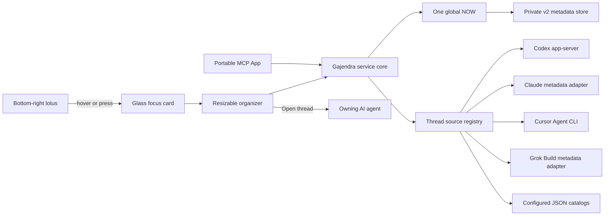

# Architecture

## Product contract

Gaja lets one person choose one current thread across configured AI agents, see the short queue behind it, and resume work in the source product. AI agents own sessions; Gaja owns only priority metadata plus an optional bounded Design/Engineering/Life context. Gajendra remains the repository and compatibility identity.

## Canonical model

Every thread ID is namespaced as `source-id:provider-thread-id`. Gaja stores only these IDs and its policy fields.

- NOW is absent or exactly one Focus entry.
- A thread appears at most once across Focus and Important.
- Moving NOW out of Focus selects the next Focus entry when available.
- Five Focus threads is guidance, not a hard limit.
- A prioritized entry may have one user-assigned `design`, `engineering`, or `life` context. Providers cannot supply it, unknown values normalize to absent, and removing the entry removes its context.
- Disabling a source hides live threads without deleting stored priority metadata; re-enabling restores resolvable entries.

## Source registry

Sources execute concurrently and return a bounded list of normalized `AgentThread` values plus health status. One failing optional source does not block a ready source. A snapshot reports an aggregate error only when every enabled source is unavailable.

Built-in source preferences default to Codex and Cursor on, with Claude and Grok Build off because both read documented local session metadata. Configured catalogs choose their own initial state. See [Thread sources](THREAD_SOURCES.md).

## Persistence and migration

The canonical macOS file is `~/Library/Application Support/Gajendra/gajendra.v2.json`. `GAJENDRA_DATA_DIR`, host `PLUGIN_DATA`, and XDG configuration are supported for tests and non-macOS hosts.

Writes create a `0600` temporary file inside a `0700` directory, then atomically rename it. The optional bounded context enum is additive within v2 and needs no content migration. If v2 state is absent, compatible Aadi and Priority Deck state is normalized to `codex:` IDs and copied. Legacy files are never moved or deleted.

Visual preferences are separate from priority state. The native companion stores only validated theme, appearance, hover-card size, pill visibility, and pill position values in `UserDefaults`. Hover-card size is a bounded Compact/Comfortable/Expanded enum; the resolved panel size derives from the active display's visible frame and never from a device-model check. The MCP App stores only the validated theme and appearance enum values in guarded browser-local storage; a host that denies storage falls back safely without affecting queue state. Neither path stores thread metadata or content.

## Resume routing

- Codex threads open `codex://threads/<provider-id>`.
- CLI-backed threads expose a structured `{executable, args, cwd}` value and a `gajendra://thread/<canonical-id>` route.
- The native app resolves that ID from its current snapshot and opens a short-lived, quoted `.command` file in Terminal.
- Generic catalogs may instead provide a direct URL.

The service never accepts a free-form shell string.

## macOS surfaces

The lotus and hover card are borderless, nonactivating floating `NSPanel` instances. They join Spaces and supported full-screen application contexts, re-clamp after display changes, and remain independent of Codex’s view hierarchy. Hovering either panel keeps the card visible; a 220 ms grace period bridges the physical gap. A single app-owned edit controller suppresses the card while the lotus jiggles, dismisses edit mode for outside clicks, and derives movement from the global pointer so the moving panel cannot feed back into its own drag coordinates.

The hover card uses a shared adaptive row grammar for both production themes. NOW remains singular and visually dominant. Focus excludes NOW from its five visible queued rows; Important shows its first five. Counts stay adjacent to lane labels, and queues longer than five expose a More action that opens the Organizer. Compact, Comfortable, and Expanded are display-scaled presentation choices only; they never change queue data or priority policy.

The organizer is a normal resizable macOS window with Dock, menu-bar, keyboard, and reopen recovery. macOS 26 uses SwiftUI `glassEffect`; macOS 13–15 use semantic material fallback. Reduce Motion is respected.

This is intentionally not a WidgetKit extension. WidgetKit is suitable for passive desktop/Notification Center summaries and click-through, but not an always-on-top cross-app hover interaction.

## MCP App surface

The portable contract is `_meta.ui.resourceUri` plus `text/html;profile=mcp-app`. Only `gajendra_open` advertises the experimental global entry point. Hosts that ignore it still retain the inline MCP App and native companion.

The web UI uses GSAP/Flip for user-action feedback and disables motion under `prefers-reduced-motion`. Native SwiftUI uses system animation only.

## Failure model

- Source failures remain visible per source and retry on refresh.
- Codex RPC uses a configurable 15-second timeout and rejects cursor loops.
- Cursor listing uses a 10-second timeout and bounded output.
- Mutations made during refresh are queued and drained in order.
- Deleted/unavailable thread references become a stale count, never synthetic sessions.
- No background updater or Codex restart loop exists.
