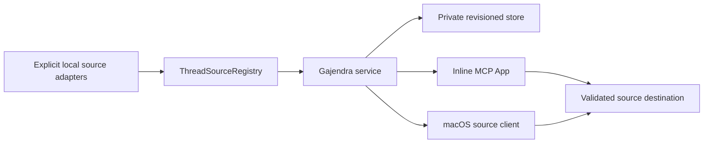

# Architecture

Gajendra — **One clear focus across your AI tools.** — keeps one global NOW, a short Focus queue,
and an Important queue while each provider retains its own sessions and credentials. Its promise is
**One NOW. One short queue. One click back to the exact thread.**

This describes the current **source-review candidate**. One exact ad-hoc local build has a narrow
installed launcher receipt; no signed, notarized, or distributed app is claimed.

## Authority and data

- Canonical IDs are `source-id:provider-thread-id`; NOW must belong to Focus.
- The store persists only IDs, priority order, the bounded Design/Engineering/Life context enum,
  source preferences, a revision, and bounded SHA-256 idempotency receipts. It never persists live
  titles, prompts, transcripts, review signals/destinations, source files, credentials, or free-text labels.
- Every mutation goes through the revisioned store authority. `expectedRevision` provides CAS;
  stale writes return a typed conflict with a fresh safe snapshot. The store serializes
  cross-process writers and supports replay-safe idempotency keys.
- `move-before` is the sole atomic queue operation. It validates source/thread/target before
  changing state, handles same-lane/cross-lane/append placement, preserves context, repairs NOW,
  and treats a self-drop as a no-op.

## Storage recovery and isolation

The macOS default is `~/Library/Application Support/Gajendra/gajendra.v2.json`. Files are bounded,
owner-private, atomically replaced, and protected by a token-owned lock/reclaim protocol. Primary
state is structurally and version validated before normalization. Invalid state is quarantined;
recovery is allowed only from a structurally valid private primary or last-known-good copy and
otherwise fails closed.

`GAJENDRA_DATA_DIR` selects a fully isolated store and intentionally supplies no legacy
`~/.codex` candidates unless explicit migration is requested. Aadi/Priority Deck migration is
copy-only.

## Sources and safe opens

Built-ins and configured sources contribute bounded normalized metadata. Configured source IDs are
unique and cannot collide with built-in or reserved namespaces. Catalog/output reads, process
capture, source selection, app-server pagination, and enrichment use explicit byte, row, worker,
and deadline bounds. Source preference changes are generation-checked so a returned snapshot does
not mix one preference generation with threads collected under another.

An optional configured-catalog `ReviewSignal` remains on the live normalized thread only. The
service projects explicit non-Running signals by review timestamp for the Ready for Review
disclosure; it does not mutate priority or store the signal. Built-in adapters currently emit none,
and remote adapters remain outside the local-source authority.

Each source declares safe destination schemes. URLs are normalized and checked when catalog data is
accepted and again immediately before a host/native open. Unknown, whitespace-padded, encoded,
`javascript:`, `data:`, and `file:` URLs fail closed.

## A4 Codex enrichment boundary

On macOS, optional Codex app-server enrichment may inspect a held path under
`~/.codex/thread-writer-locks`. The matching rollout is realpath-confined beneath
`~/.codex/sessions`, opened without following links, and bounded to its final 256 KiB. Only
allow-listed lifecycle markers after the final `task_complete` marker can affect a status. No raw
tail, response item, message, or coordination payload is exposed or persisted. Set
`GAJENDRA_CODEX_ACTIVITY_ENRICHMENT=off` to disable it. Any failed lock/path/open/probe/parse keeps
the app-server status rather than inferring activity.

## Native and release boundary

The native source targets macOS 13.5 and expects a bundle containing checksum-verified Node
v24.19.0 plus notices. It is a source/build contract only. Current documentation makes no claim
that the candidate is installed, has completed physical interaction/accessibility checks, has been
Developer ID signed/notarized, or is downloadable. See [Companion](COMPANION.md) and
[Status](../STATUS.md).

Mobile is not an architecture component today. The retained mobile material is a documentation-only
E0 plan with no listener, relay, mobile application, or credentials.
