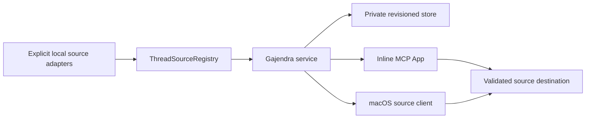

# Architecture

Gajendra — **One clear focus across your AI tools.** — keeps one global NOW, a short Focus queue,
and an Important queue while each provider retains its own sessions and credentials. Its promise is
**One NOW. One short queue. One click back to the exact thread.**

This describes the current **source-review candidate**. One exact ad-hoc local build has an
installed automated interaction receipt; no clean-Mac, physical-accessibility, signed, notarized,
or distributed app claim is made.

## Authority and data

- Canonical IDs are `source-id:provider-thread-id`; NOW must belong to Focus.
- The store persists only IDs, priority order, the bounded Design/Engineering/Life context enum,
  source preferences, a revision, bounded SHA-256 idempotency receipts, and at most 1,024 SHA-256
  review acknowledgement receipts. It never persists live titles, prompts, transcripts, review
  timestamps/statuses/destinations, source files, credentials, or free-text labels.
- Every mutation goes through the revisioned store authority. `expectedRevision` provides CAS;
  stale writes return a typed conflict with a fresh safe snapshot. The store serializes
  cross-process writers and supports replay-safe idempotency keys.
- `move-before` is the sole atomic queue operation. It validates source/thread/target before
  changing state, handles same-lane/cross-lane/append placement, preserves context, repairs NOW,
  and treats a self-drop as a no-op.

## Storage recovery and isolation

The macOS default is `~/Library/Application Support/Gajendra/gajendra.v2.json`. Files are bounded,
owner-private, atomically replaced, and protected by a token-owned lock/reclaim protocol. Primary
state is structurally and version validated before normalization. Invalid state is quarantined;
recovery is allowed only from a structurally valid private primary or last-known-good copy and
otherwise fails closed.

`GAJENDRA_DATA_DIR` selects a fully isolated store and intentionally supplies no legacy
`~/.codex` candidates unless explicit migration is requested. Aadi/Priority Deck migration is
copy-only.

## Sources and safe opens

Built-ins and configured sources contribute bounded normalized metadata. Configured source IDs are
unique and cannot collide with built-in or reserved namespaces. Catalog/output reads, process
capture, source selection, app-server pagination, and enrichment use explicit byte, row, worker,
and deadline bounds. Source preference changes are generation-checked so a returned snapshot does
not mix one preference generation with threads collected under another. The outer source-generation
budget is a derived 70-second provider/store envelope, not the store's 30-second stale-lock recovery
marker: accepted Codex bounds cover experimental initialize, bounded fallback teardown, baseline
initialize, listing, and the hard-capped runtime enrichment. The initial private store read is
included before provider work; explicit `generationDeadlineMs` callers may still choose a tighter
bound. The native client wraps that source-generation budget in an 85-second process watchdog over
later store and process work. At the threshold it initiates TERM/KILL, after which process-group and
pipe-drain cleanup follows; 85 seconds is therefore a termination threshold, not a strict response
deadline.

An optional adapter `ReviewSignal` remains on the live normalized thread only. The service projects
explicit non-Running signals by review timestamp for the Ready for Review disclosure; it does not
mutate priority or store the signal. An explicit reversible `set-review-acknowledged` mutation
validates the current non-Running signal and exact timestamp, derives a receipt from the canonical
thread ID, timestamp, kind, and destination, and suppresses only that matching projection. A newer
timestamp or changed kind/destination reappears. Opening is side-effect free. The current generation
identity is limited by the provider metadata that passes the privacy guard: Unix-second timestamp,
kind, and destination. Two distinct completions in the same second with the same kind and destination
are therefore indistinguishable until Codex exposes an allow-listed opaque turn identity. Configured
catalogs may declare the validated structure. The current local Codex adapter may derive it only from
a bounded `thread/turns/list` response requested
with `itemsView: notLoaded`: exactly one newest turn, zero items, terminal `completed`, no error, and
a renderable, non-future Unix-second completion timestamp. A valid non-completed turn emits no
signal for that candidate; malformed, content-returning, deadline, or invalid-time evidence clears
the optional batch. Other built-ins and remote adapters remain outside that authority.

Each source declares safe destination schemes. URLs are normalized and checked when catalog data is
accepted and again immediately before a host/native open. The web surface also binds immutable
thread/review intent at render time and re-resolves that exact destination from the current
authoritative snapshot after its press animation, so mutable DOM attributes or a concurrent refresh
cannot redirect an Open action. Unknown, whitespace-padded, encoded, `javascript:`, `data:`, and
`file:` URLs fail closed.

Review acknowledgements reuse the version-3 store as an additive optional field so existing files
remain readable. Rolling back to an older v3 writer can drop that unknown field on its next write,
which may make handled Ready items reappear; it does not corrupt priority state. The service replaces
an older receipt for the same thread and rejects a new-thread acknowledgement at the 1,024-thread
ceiling rather than silently evicting another handled response.

## A4 Codex enrichment boundary

On macOS, optional Codex app-server enrichment may inspect a held path under
`~/.codex/thread-writer-locks`. The matching rollout is realpath-confined beneath
`~/.codex/sessions`, opened without following links, and bounded to its final 256 KiB. Only
allow-listed lifecycle markers after the final `task_complete` marker can affect a status. No raw
tail, response item, message, or coordination payload is exposed or persisted. Set
`GAJENDRA_CODEX_ACTIVITY_ENRICHMENT=off` to disable it. Any failed lock/path/open/probe/parse keeps
the app-server status rather than inferring activity.

## Native and release boundary

The native source targets macOS 13.5 and expects a bundle containing checksum-verified Node
v24.19.0 plus notices. The exact local ad-hoc candidate has an installed automated interaction
receipt; that does not establish clean-Mac or physical interaction/accessibility proof. It has not
been Developer ID signed/notarized and is not downloadable. See [Companion](COMPANION.md) and
[Status](../STATUS.md).

Mobile is not an architecture component today. The retained mobile material is a documentation-only
E0 plan with no listener, relay, mobile application, or credentials.
