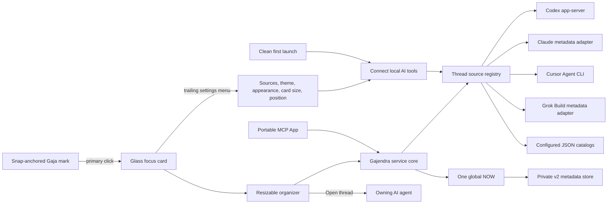

# Architecture

## Product contract

Gaja lets one person choose one current thread across configured AI agents, see the short queue behind it, and resume work in the source product. AI agents own sessions; Gaja owns only priority metadata plus an optional bounded Design/Engineering/Life context. Gajendra remains the repository and compatibility identity.

## Canonical model

Every thread ID is namespaced as `source-id:provider-thread-id`. Gaja stores only these IDs and its policy fields.

- NOW is absent or exactly one Focus entry.
- A thread appears at most once across Focus and Important.
- Moving NOW out of Focus selects the next Focus entry when available.
- Five Focus threads is guidance, not a hard limit.
- Running is a derived, deduplicated projection of every loaded thread whose provider status explicitly normalizes to active work, including NOW, Focus, and Important. It is not a third priority level, is never persisted, and never infers activity from recency or resumability.
- A prioritized entry may have one user-assigned `design`, `engineering`, or `life` context. Providers cannot supply it, unknown values normalize to absent, and removing the entry removes its context.
- Disabling a source hides live threads without deleting stored priority metadata; re-enabling restores resolvable entries.

## Source registry

Sources execute concurrently and return a bounded list of normalized `AgentThread` values plus health status. Each source retains its 200 most recent non-running threads plus every explicitly running thread, so a long history cannot evict active work. One failing optional source does not block a ready source. A snapshot reports an aggregate error only when every enabled source is unavailable.

Built-in source preferences default to Codex and Cursor on, with Claude and Grok Build off because both read documented local session metadata. Configured catalogs choose their own initial state. See [Thread sources](THREAD_SOURCES.md).

On a clean native first launch, a single source-onboarding window renders the registry's real health rows and mutates the same source preferences as the organizer. It is skippable, keyboard-accessible, and replayable from Settings or the application menu. The setup does not invent account connections: **Rescan** requests a normal local registry refresh. A native-install preference check silently completes the onboarding migration for existing users so an upgrade does not unexpectedly interrupt them.

## Persistence and migration

The canonical macOS file is `~/Library/Application Support/Gajendra/gajendra.v2.json`. `GAJENDRA_DATA_DIR`, host `PLUGIN_DATA`, and XDG configuration are supported for tests and non-macOS hosts.

Writes create a `0600` temporary file inside a `0700` directory, then atomically rename it. The optional bounded context enum is additive within v2 and needs no content migration. If v2 state is absent, compatible Aadi and Priority Deck state is normalized to `codex:` IDs and copied. Legacy files are never moved or deleted.

Visual and onboarding preferences are separate from priority state. The native companion stores only validated theme, appearance, hover-card size, pill visibility, one of six bounded pill anchors, the selected display number, and one source-onboarding completion boolean in `UserDefaults`. Source enablement remains in the private v2 metadata store. Legacy free-position coordinates are migrated once to the nearest anchor. Hover-card size is a bounded Compact/Comfortable/Expanded enum; the resolved panel size derives from the active display's visible frame and never from a device-model check. The MCP App stores only the validated theme and appearance enum values in guarded browser-local storage; a host that denies storage falls back safely without affecting queue state. Neither path stores thread metadata or content.

## Resume routing

- Codex threads open `codex://threads/<provider-id>`.
- CLI-backed threads expose a structured `{executable, args, cwd}` value and a `gajendra://thread/<canonical-id>` route.
- The native app resolves that ID from its current snapshot and opens a short-lived, quoted `.command` file in Terminal.
- Generic catalogs may instead provide a direct URL.

The service never accepts a free-form shell string.

## macOS surfaces

The Gaja mark and focus card are borderless, nonactivating floating `NSPanel` instances. Only the detail panel opts into becoming key when its search field needs keyboard input; the launcher remains non-keyable. They join Spaces and supported full-screen application contexts, re-clamp after display changes, and remain independent of Codex’s view hierarchy. Primary click toggles a pinned card; hover changes only the launcher affordance. The card remains interactive until another launcher click, an outside click, or Escape. The native header separates identity from configuration: the elephant-and-lotus mark stays at the left, the two-line Gaja lockup is geometrically centered independently of asymmetric controls, and Organizer, Refresh, then a conventional Settings gear occupy the right edge. The gear owns source setup, theme, Auto/Light/Dark appearance, card size, and lotus position; opening it never mutates a preference.

Top Left, Top Right, Center, Bottom Left, Bottom Center, and Bottom Right are bounded, persisted anchors exposed in the brand settings and application menus. Center opens the card to the side; edge anchors open it inward. A single app-owned edit controller enters on double-click, suppresses the card while only the mark artwork and X jiggle, ignores movement below six points, and derives intentional movement from the global pointer. Drag release snaps to the nearest anchor without reopening the card. Outside clicks and Escape end edit mode. A short contextual menu exposes show/hide, Organizer, move/hide, and a destructive **Uninstall Gaja…** action; the uninstall path requires confirmation, unregisters Launch at Login, moves only the app bundle to Trash, and retains priority metadata.

The focus card uses a shared adaptive row grammar for both production themes. NOW remains singular and visually dominant, with one left-to-right action group: Open, explicit Running/Ready plus recency, then Provider. Focus excludes NOW from its five visible queued rows; Important shows its first five. Counts stay adjacent to lane labels, and queues longer than five expose a bottom-edge Organizer shortcut. An expandable vertical Running section follows both lanes and includes every explicit active thread; placement labels identify threads that also appear in NOW, Focus, or Important. NOW, the queues, Running, and search results share one vertical scroll body. A full-width search capsule occupies a sibling footer, remains visible without covering rows, focuses from the complete capsule, selects an existing query on focus, queries the deduplicated loaded catalog with multi-term metadata matching, and exposes open, NOW, tier, context, remove, and provider actions in place. NOW and search highlight their complete rounded surfaces on hover or focus. Snapshot ingestion defensively normalizes selection against the canonical `current` ID, so malformed provider payloads cannot render two NOW selections. Compact, Comfortable, and Expanded are display-scaled presentation choices only; they never change queue data or priority policy.

The organizer is a normal resizable macOS window with Dock, menu-bar, keyboard, and reopen recovery. macOS 26 uses SwiftUI `glassEffect`; macOS 13–15 use semantic material fallback. Reduce Motion is respected.

This is intentionally not a WidgetKit extension. WidgetKit is suitable for passive desktop/Notification Center summaries and click-through, but not this always-on-top cross-app interactive panel.

## MCP App surface

The portable contract is `_meta.ui.resourceUri` plus `text/html;profile=mcp-app`. Only `gajendra_open` advertises the experimental global entry point. Hosts that ignore it still retain the inline MCP App and native companion.

The web UI uses a two-row shell: one bounded scroll surface plus a labeled all-thread search footer, so controls never cover drag targets. Running uses the same expanded/collapsed disclosure contract as native. GSAP/Flip handles user-action feedback and disables motion under `prefers-reduced-motion`. Native SwiftUI uses system animation only.

## Failure model

- Source failures remain visible per source and retry on refresh.
- Codex RPC uses a configurable 15-second timeout and rejects cursor loops.
- Cursor listing uses a 10-second timeout and bounded output.
- Mutations made during refresh are queued and drained in order.
- Deleted/unavailable thread references become a stale count, never synthetic sessions.
- No background updater or Codex restart loop exists.
