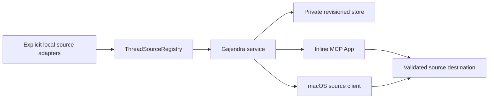

# Architecture

Gajendra — **One clear focus across your AI tools.** — keeps at most one selected global NOW, a short Focus queue,
and an Important queue while each provider retains its own sessions and credentials. Its promise is
**One NOW. One short queue. One click back to the exact thread.**

This describes the **0.4.0 source release**. Earlier installed receipts do not prove this
release. Current installation/host acceptance, clean-Mac, physical accessibility, signing,
notarization, and distribution require their own evidence.

```mermaid
flowchart LR
  Sources["Explicit local source adapters"] --> Registry["ThreadSourceRegistry"]
  Registry --> Service["Gajendra service"]
  Service --> Store["Private revisioned store"]
  Service --> MCP["Inline MCP App"]
  Service --> Native["macOS source client"]
  MCP --> Open["Validated source destination"]
  Native --> Open
```

## Authority and data

- Canonical IDs are `source-id:provider-thread-id`; NOW must belong to Focus.
- The store persists only IDs, priority order, the bounded Design/Engineering/Life context enum,
  source preferences, explicit completed IDs and exact continuation relationships, a bounded
  `nowSelection` enum, a revision, bounded SHA-256 idempotency receipts, and at most 1,024 SHA-256
  review acknowledgement receipts. It never persists live titles, prompts, transcripts, review
  timestamps/statuses/destinations, source files, credentials, or free-text labels.
- Every mutation goes through the revisioned store authority. `expectedRevision` provides CAS;
  stale writes return a typed conflict with a fresh safe snapshot. The store serializes
  cross-process writers and supports replay-safe idempotency keys.
- `move-before` is the atomic placement operation. It validates source/thread/target before
  changing state, handles same-lane/cross-lane/append placement, preserves context, repairs NOW,
  and rejects invalid targets.

## Shared product state

The service emits one `product` projection for both surfaces: `readyForReview`, `needsInput`,
`running`, `continue`, and `history`. Running takes precedence over input/review. Needs input
requires the configured catalog's explicit `attention: "needs-input"`; built-ins do not infer it
from generic waiting. Ready is independent of age and priority. Explicitly finished work leaves Ready until Reopen; its response evidence remains in History.
Continue contains open prioritized current chats; History includes completed work, predecessors,
and other inactive chats. Search retains exact individual chat identities.

`set-work-completed` preserves priority/context/order and pending review evidence in History without acknowledging it. Completed chats, including later closing replies, stay out of Ready until Reopen. Finishing NOW
sets `nowSelection: "cleared"` and leaves no replacement. Reopen restores Continue eligibility;
NOW is selected explicitly (an inverse mutation can restore it atomically). `link-continuation`
uses exact available IDs and transfers priority/context/order/NOW to the successor. It rejects
cycles, ambiguous existing priorities, invalid namespaces, and conflicting links. The latest edge
can be unlinked atomically. Neither action reads or mutates provider conversations. Each bounded
workflow collection admits up to 1,024 records and rejects overflow rather than evicting history.

## Storage recovery and isolation

The October 5 read-path implementation shares one session-scoped local backend between native CLI
requests and MCP. It uses an owner-private Unix socket, keyed by build and data/provider scope,
with no TCP listener or launch agent. Concurrent refresh requests join one collection; provider
work is serialized, and a review acknowledgement never joins an earlier pre-click collection.
The owner exits after five idle minutes. `GAJENDRA_SHARED_BACKEND=off` restores per-client execution.

The backend holds a 30-second in-memory catalog of normalized thread metadata, separate from the
revisioned durable store. Reads recompose current priorities/workflow state without discovery;
`--read-json` returns the prepared view and starts a background refresh when only a disk fallback
is available. `catalogRevision` lets visible clients pick up background results without rescanning.
Account/source preferences, source-configuration replacement and lifecycle epochs invalidate reuse.
Executable resume commands are removed from the memory projection as well as disk caches; native
resume obtains fresh source metadata before opening a CLI destination.

Local priority/context/order/collapse/workflow changes can use the scoped known catalog, including
neutral saved rows when sources are offline. They still validate IDs and transact against current
durable state with CAS/idempotency. Review acknowledgement always obtains fresh provider evidence.
Source changes still collect under the new preference generation. No durable data schema changes.

The native first-opening path calls `--cached-snapshot-json` followed by `--read-json`;
`gajendra_open` is likewise cache-first unless `refresh: true` requests a live snapshot. The disk fallback
reads only the disposable projection plus current authoritative state. `--read-json` can schedule
discovery in the background. `cachedAt` labels disk fallback age, with neutral activity until live data arrives.
Each ordinary refresh still lists current provider metadata to discover changes, removals and
new continuations. Only unchanged Codex completion checks are reused across backend processes;
changed threads and review acknowledgements receive fresh metadata checks. Visible clients check
`gajendra_sync`/`--sync-json` about every five seconds and request ordinary
source refreshes about every thirty seconds, plus provider latency. Optional trusted hooks replace
one private invalidation token without scanning sources. Sync returns optional `activityRevision`;
live snapshots capture it before provider work. Completion-cache reuse requires a matching epoch,
including after racing writes. This is invalidation, not a provider event subscription or delta API.
See [Daily widget](DAILY-WIDGET.md).

The macOS default is `~/Library/Application Support/Gajendra/gajendra.v2.json`. Files are bounded,
owner-private, atomically replaced, and protected by a token-owned lock/reclaim protocol. Primary
state is structurally and version validated before normalization. Invalid state is quarantined;
recovery is allowed only from a structurally valid private primary or last-known-good copy and
otherwise fails closed.

`GAJENDRA_DATA_DIR` selects a fully isolated store and intentionally supplies no legacy
`~/.codex` candidates unless explicit migration is requested. Aadi/Priority Deck migration is
copy-only.

## Sources and safe opens

Built-ins and configured sources contribute bounded normalized metadata. Configured source IDs are
unique and cannot collide with built-in or reserved namespaces. Catalog/output reads, process
capture, source selection, app-server pagination, and enrichment use explicit byte, row, worker,
and deadline bounds. Source preference changes are generation-checked so a returned snapshot does
not mix one preference generation with threads collected under another. The outer source-generation
budget is a derived 70-second provider/store envelope, not the store's 30-second stale-lock recovery
marker: accepted Codex bounds cover experimental initialize, bounded fallback teardown, baseline
initialize, listing, and the hard-capped runtime enrichment. The initial private store read is
included before provider work; explicit `generationDeadlineMs` callers may still choose a tighter
bound. The native client wraps that source-generation budget in an 85-second process watchdog over
later store and process work. At the threshold it initiates TERM/KILL, after which process-group and
pipe-drain cleanup follows; 85 seconds is therefore a termination threshold, not a strict response
deadline.

An optional adapter `ReviewSignal` remains on the live normalized thread only. The service projects
explicit non-Running signals by review timestamp for the Ready for Review disclosure; it does not
mutate priority or store the signal. An explicit reversible `set-review-acknowledged` mutation
validates the current non-Running signal and exact timestamp, derives a receipt from the canonical
thread ID, timestamp, kind, and destination, and suppresses only that matching projection. A newer
timestamp or changed kind/destination reappears. Opening is side-effect free. The current generation
identity is limited by the provider metadata that passes the privacy guard: Unix-second timestamp,
kind, and destination. Two distinct completions in the same second with the same kind and destination
are therefore indistinguishable until Codex exposes an allow-listed opaque turn identity. Configured
catalogs may declare the validated structure. The current local Codex adapter may derive it only from
a bounded `thread/turns/list` response requested
with `itemsView: notLoaded`: exactly one newest turn, zero items, terminal `completed`, no error, and
a renderable, non-future Unix-second completion timestamp. A valid non-completed turn emits no
signal for that candidate; malformed, content-returning, deadline, or invalid-time evidence clears
the optional batch. Other built-ins and remote adapters remain outside that authority.

Each source declares safe destination schemes. URLs are normalized and checked when catalog data is
accepted and again immediately before a host/native open. The web surface also binds immutable
thread/review intent at render time and re-resolves that exact destination from the current
authoritative snapshot at dispatch, without waiting for decorative press feedback, so mutable DOM attributes or a concurrent refresh
cannot redirect an Open action. Unknown, whitespace-padded, encoded, `javascript:`, `data:`, and
`file:` URLs fail closed.

Review acknowledgements and workflow fields extend version 3 additively, so existing files remain
readable. Preserve a private store/backup before rollback: an older writer can drop review receipts,
completion/continuation IDs, and cleared-NOW state on its next write. Review items may reappear and
older clients cannot represent the new lifecycle choices. The service replaces
an older receipt for the same thread and rejects a new-thread acknowledgement at the 1,024-thread
ceiling rather than silently evicting another handled response.

## A4 Codex enrichment boundary

On macOS, optional Codex app-server enrichment may inspect a held path under
`~/.codex/thread-writer-locks`. The matching rollout is realpath-confined beneath
`~/.codex/sessions`, opened without following links, and bounded to its final 256 KiB. Only
allow-listed lifecycle markers after the final `task_complete` or `turn_aborted` marker can affect a status. No raw
tail, response item, message, or coordination payload is exposed or persisted. Set
`GAJENDRA_CODEX_ACTIVITY_ENRICHMENT=off` to disable it. Any failed lock/path/open/probe/parse keeps
the app-server status rather than inferring activity. Missing held interactive roots may be read
through metadata-only `thread/read`, then subjected to the same lifecycle/path guards within the
remaining activity budget. Optional recovery failure does not erase completed listed-task enrichment.

## Native and release boundary

The native source targets macOS 13.5 and expects a bundle containing checksum-verified Node
v24.19.0 plus notices. Earlier ad-hoc builds have installed automated interaction
receipts; these do not prove the current 0.4.0 candidate or clean-Mac/physical accessibility. It has not
been Developer ID signed/notarized and is not downloadable. See [Companion](COMPANION.md) and
[Status](../STATUS.md).

Mobile is not an architecture component today. The retained mobile material is a documentation-only
E0 plan with no listener, relay, mobile application, or credentials.
