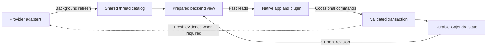

# Backend thread cache assessment

Owner: Sid. No deadline supplied. Decision enabled: choose the next backend change for frequent
reads and occasional Gajendra writes. Acceptance for this assessment: inspect the actual native,
MCP, cache and store paths; measure cache versus live reads; specify authority, freshness and
concurrency requirements. Stop at a measured recommendation; this is not a backend migration receipt.

Inspected local dirty 0.4.0 candidate on `codex/gajendra-extension-recovery`, based on
`381a31cc92904082b26c01df0c425cb323992307`. Existing work is preserved. No source, runtime,
installed configuration, provider thread or private priority mutation was made by this assessment.

## Decision

Extend the existing backend into a shared, ready-to-read thread catalog. Separate frequent reads,
local user mutations and slower provider refreshes. Retain the existing transactional durable store;
do not start with a database migration. Provider collection is the evidenced latency problem.
An always-running service is a proposed implementation, not installed by this assessment.

“All thread data” means all metadata available through enabled, bounded adapters plus Gajendra's
own durable state. It does not establish an exhaustive archive of every provider conversation.
Prompts, transcripts, raw responses, credentials and executable commands are outside the cache
contract. Providers remain authoritative for their threads and current execution state.

## Existing implementation

| Layer | Current behavior | Limitation |
| --- | --- | --- |
| Authoritative store | Shared cross-process JSON store with locking, atomic writes, revision checks and idempotency receipts | Even reads acquire the store lock; measurement does not show this as the main bottleneck |
| Thread launch cache | Shared private disk catalog; combined with freshly read user state; all loaded activity becomes neutral cached status | Maximum one day; intentionally strips reviews and commands, so it is not a complete live read model |
| Completion cache | Reuses unchanged Codex completion checks, normally for five minutes | Every live refresh still lists providers and enriches activity; review acknowledgement forces fresh completion evidence |
| Native client | Separate Node process for cache, sync, snapshot and mutation commands | No persistent in-memory catalog across requests |
| MCP backend | Long-lived service instance | Source-collection reuse is scoped to a single snapshot/mutation, not a shared cached generation |
| Synchronization | Five-second revision polling and roughly thirty-second provider refresh while visible | A local store revision change currently triggers provider refresh too |
| Mutations | Collects sources before the durable transaction, including collapse and local priority changes | Local writes can wait on unrelated provider discovery |

Authority already lives at the backend for NOW, priority/order/context, explicit completion,
continuation relationships and exact-response review receipts. The missing piece is a shared
prepared read model, not moving these choices out of the UI for the first time.

## Current measurements

Measured the installed bundled Node/server CLI, sequentially, against a private isolated copy of
the current state and existing metadata cache. Live reads used the configured providers read-only.
Each timing includes child-process startup, backend work, JSON output and teardown. These are not
popup/render timings, controlled cold-cache benchmarks or a production latency percentile.

| Operation | Three measured runs |
| --- | --- |
| Local revision read | 99.7, 78.6, 78.8 ms |
| Cached catalog read | 134.0, 103.9, 100.1 ms |
| Provider refresh | 15,462.5 ms with Codex source error and cached fallback; 17,651.1 and 18,306.5 ms healthy |

All cached results held 449 discovered threads. Healthy live reads also returned 449. The first
provider failure is not counted as a healthy latency result; its exact cause was not diagnosed.
Aggregate raw timings are in ignored `.artifacts/cache-assessment-2026-10-05/timings.json`.
No private titles, thread IDs or content are copied into this report.

Existing cache/invalidation tests: **13 passed across 2 files**. These cover zero completion RPCs
for unchanged warm metadata, checking changed/expired entries, neutral cached status, current
priorities, private allow-list persistence, fresh acknowledgement evidence and invalidation races.
Private priorities remained byte-identical at revision 220 during this assessment.

## Proposed backend flow

1. One backend owner holds the current catalog indexed by canonical thread ID and exposes it to
   both clients. Retain the private disk launch projection for restart/offline fallback. Native
   and MCP transports must reach the same owner; adding only an MCP memory cache is insufficient.
2. Reads compose current durable user state with the latest catalog generation. Opening, searching,
   filtering and reading priorities must not await provider listing. Return source freshness/error
   information separately from the authoritative user-state revision.
3. Refresh work runs separately and overlapping requests join the same refresh. Scope by account,
   source configuration/preferences and invalidation epoch. A result started before a newer epoch
   cannot overwrite the newer catalog. Refresh healthy sources independently; failures retain
   explicitly stale rows and cannot manufacture current Running/Ready evidence.
4. Local commands such as collapse/reorder update the durable store transactionally, then rebuild
   the view at the new revision. Retain expectedRevision, replay keys, cross-client conflict handling
   and Undo. Commands requiring source existence/destinations validate the relevant thread; review
   acknowledgement still requires fresh exact-response evidence. Do not replace that with a blind
   write against stale cache data.
5. Refresh notifications or revision polling distribute the new view to both clients. A local
   state revision change should recompose the view without rescanning unchanged providers. Use
   existing polling as fallback where provider change events or targeted reads are unavailable.

The full live catalog can remain in backend memory initially. Persisting extra review signals or
executable routes is not necessary for this step and would require an explicit data-contract
amendment. On backend restart, the existing neutral launch cache remains honest until refreshed.

## Bounded implementation acceptance

- Repeat reads cause no additional provider collection; concurrent refreshes coalesce.
- Local-only commands do not depend on provider availability and remain durable across restart.
- Both clients see the same committed revision; old refresh completion cannot roll state back.
- Changed/removed threads, source/account changes and invalidation races update the correct catalog.
- Running/input/new-response precedence, exact acknowledgement, retry and Undo remain intact.
- Restart/offline results are labeled stale; no transcript/command persistence expansion.
- Compare the same installed read flows above, then inspect first paint and cross-client changes in
  the real interfaces. Process-level timing alone cannot establish UI latency.

Use a reversible opt-in trial before adopting a new background-service lifecycle permanently.
Stop or revert the trial if it fails to avoid repeated provider work, adds inconsistent views, or
shows stale activity as current. No new database, cloud service or provider subscription is needed
to begin proving the read path. Database choice can follow measured storage/query constraints.

## Source pointers

- `plugins/gajendra/src/server/metadata-cache.ts`: private projection and completion caches.
- `plugins/gajendra/src/server/service.ts`: snapshot composition and pre-transaction collection.
- `plugins/gajendra/src/server/store.ts`: shared authority, locks, revision and recovery.
- `plugins/gajendra/src/server/index.ts`: cache-first MCP open, CLI command lifecycle.
- `companion/macos/Sources/GajendraKit/DeckClient.swift`: per-request process execution.
- `plugins/gajendra/src/ui/main.ts`: local revision changes currently request live refresh.
- `docs/DAILY-WIDGET.md` and `SECURITY.md`: existing cache authorization and data boundaries.

## Subsequent implementation

The owner subsequently authorized implementation and performance testing. The completed local
changes, measurements, installation receipts and limitations are recorded in
[the performance worksheet](2026-10-05-backend-cache-performance.md). This assessment remains
the pre-implementation record.
