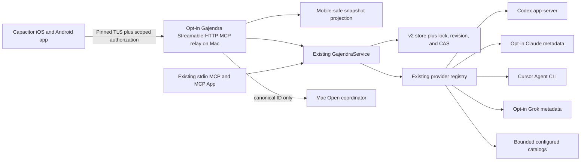

# Gajendra mobile app implementation plan

**State:** `plan_generated` — product implementation requires the repository owner's explicit approval.

**Product language:** **Gajendra** — **One clear focus across your AI tools.** The portable
product promise remains **One NOW. One short queue. One click back to the exact thread.** Queue
labels stay NOW, Focus, Important, and Running.

**E0 amendment:** complete as a documentation-only protocol/security freeze on 2026-08-18. It
does not authorize a listener, mobile app, dependency, credential, or implementation spike.

**Prepared:** 2026-08-17

**Repository baseline (historical):** `53e9855e8d19f90bb1d35e7432d5bc514e418f67` on clean `main`
at preparation; the current checkout is dirty and live repo truth must be rechecked.

**Durable planning pack:** [index and resume guide](gajendra-mobile/README.md). The linked plans
decompose this master decision record into architecture/security, product parity, provider
contracts, implementation workstreams, test/Gauntlet, toolchain/device readiness, and
decision/risk/approval registers. The pack is planning evidence only; it does not approve or imply
implementation.

## Contract

### Requested outcome

Build iOS and Android Gajendra apps that preserve the portable focus-card and organizer behavior of the
current Gajendra widget, and connect them to every currently supported provider through a secure
MCP-compatible path.

### Decision enabled

Approve or reject a new same-LAN mobile trust boundary before product code is written.

- Product and approval owner: the repository owner.
- Implementation owner: Codex orchestration with one writer per artifact.
- Deadline: none supplied.
- Stop condition: both platforms pass the mobile and desktop gauntlets plus real-device paired-LAN
  UAT, or a named kill criterion returns the work to planning.
- Publication, store release, cloud access, signing, notarization, provider-account changes, and
  merge remain outside this approval.

## Feasibility verdict

**Conditional go.** A mobile companion is feasible. A literal phone-to-each-provider MCP design is
not: Codex, Claude Code, Cursor, Grok Build, and configured agents are currently Mac-local adapters,
not a uniform set of remote MCP servers.

The viable product is one opt-in Gajendra Streamable-HTTP MCP relay hosted by the Mac. The phone is
a paired client. The Mac remains the only provider-reading and priority-writing authority.

“Portable parity” means the current NOW, Focus, Important, Running, search, context, source-health,
theme, accessibility, and organizer behaviors. These desktop-only interactions intentionally adapt:

| Desktop behavior | Mobile behavior |
| --- | --- |
| Floating lotus, hover, six anchors, jiggle/edit mode | Normal application entry; no cross-app floating overlay |
| Click-pinned card, outside click, Escape | Native navigation, sheet dismissal, iOS/Android Back |
| Resizable organizer window | Full-screen organizer |
| Provider resume on the Mac | Explicit **Open on Mac** action |
| Source setup/toggles | Read-only source health; source enablement remains Mac-only |
| Offline state | Disconnected state; no persisted thread snapshot |

## Architectural decision



1. Preserve the existing stdio MCP, inline MCP App, native macOS app, current eight-tool surface,
   and current degradation behavior.
2. Add a separate, opt-in Streamable-HTTP MCP relay using the current MCP SDK v2 packages. Keep the
   v1 stdio path until compatibility tests prove migration safety.
3. Target MCP revision `2026-07-28`: one POST endpoint, one request per POST, no protocol-level
   sessions, no GET stream dependency, required request metadata/header validation, Origin
   validation, protected-resource discovery, resource-bound tokens, PKCE/issuer validation, and no
   token passthrough. Request-scoped JSON or SSE responses remain possible; a long-lived
   `subscriptions/listen` stream is a later, separately approved capability, not a mobile
   dependency.
4. Project `DeckSnapshot` into a mobile-safe DTO. Never transmit `resumeCommand`, executable,
   arguments, absolute `cwd`, provider deep link, raw provider output, or arbitrary URL.
5. Expose **Open on Mac** as a scoped relay operation accepting only a currently resolvable canonical
   thread ID. The Mac resolves the trusted destination.
6. Serialize cross-process store mutations and add monotonic revision, optimistic concurrency/CAS,
   and idempotency before mobile write access.
7. Reuse the current responsive web UI in Capacitor v8. A small native Swift/Kotlin transport plugin
   exclusively owns TLS pinning, authorization, secure storage, QR pairing, and platform permissions.
8. Keep one serialized authoritative store and one active Mac relay writer. Every mobile mutation
   carries `expectedRevision` and an idempotency key and uses compare-and-swap; stale writers and
   stale relay instances fail closed.

Authoritative protocol references:

- https://modelcontextprotocol.io/specification/2026-07-28/basic/transports/streamable-http
- https://modelcontextprotocol.io/specification/2026-07-28/basic/authorization
- https://developer.apple.com/documentation/technotes/tn3179-understanding-local-network-privacy
- https://developer.apple.com/documentation/BundleResources/Information-Property-List/NSLocalNetworkUsageDescription
- https://developer.android.com/privacy-and-security/local-network-permission
- https://developer.android.com/about/versions/17/behavior-changes-17
- https://capacitorjs.com/docs

## E0 protocol and security amendment

This is the required documentation-only amendment from the release handoff. It freezes the
security invariants and ownership boundaries while leaving implementation-dependent values
configurable or pending. It does not create or imply a listener, OAuth server, mobile app,
credential, dependency, target OS, or supported device.

| Area | Frozen v1 contract | Configurable or pending before implementation | Required proof |
| --- | --- | --- | --- |
| Authorization-server ownership and lifecycle | The foreground Gajendra Mac component owns the protected relay and its local authorization boundary. No cloud or public authorization server is used in v1. Relay and authorization state start only after explicit Mobile Relay enablement and stop with the owning app; no daemon, LaunchAgent, background service, or independent writer. | Exact OAuth library, endpoint paths, authorization-server metadata, signing-key storage, and token lifetimes remain spike decisions. If a separate authorization server becomes necessary, D01 reopens. | Start/stop lifecycle, no-listener-by-default, process-death, and no-public-bind tests; ownership recorded in the approval receipt. |
| Client registration, bootstrap, and pairing | A QR/manual bootstrap carries only the relay endpoint/canonical resource URI, relay instance ID, certificate/SPKI fingerprint, authorization metadata location, and single-use pairing nonce. It never carries an access token, refresh token, private key, provider credential, command, URL destination, or provider content. The phone generates a device key in Keychain/Keystore, validates the pinned identity, shows a matching code, and requires Mac approval before authorization. | First-party pre-registration is the v1 default. Client ID Metadata Documents and Dynamic Client Registration are compatibility options, with DCR deprecated by the current MCP authorization revision. Exact client ID, callback URI, and registration metadata are selected during the approved spike; no fabricated value is treated as supported. | QR redaction, nonce replay/expiry, wrong-device, matching-code, registration, and pairing-retry tests. |
| Redirect/callback and proof-of-possession | Authorization is owned by the native transport plugin, never by arbitrary WebView navigation. The callback must return to the native app through a claimed platform callback or explicitly approved private-use callback; it validates state, PKCE verifier, recorded issuer, and resource before exchanging a code. The paired device public key is bound to the authorization record and is required for relay proof-of-possession; bearer tokens alone never identify an approved device. | Exact callback URI family and PoP envelope (for example, a native request signature or mTLS profile) remain configurable/pending the security spike. No callback may accept an unallow-listed host, arbitrary deep link, or WebView-originated code. | Issuer-mix-up, state/PKCE mismatch, callback allow-list, wrong-key, replay, and proof-of-possession tests. |
| Access/refresh lifetimes, rotation, reuse, revoke, lost device | Access tokens are resource/audience-bound and sent only in `Authorization: Bearer`; never in query strings, QR data, logs, screenshots, or provider requests. Refresh tokens, if issued, remain only in platform secure storage and are rotated when the authorization server supports rotation. Reuse or invalid refresh material revokes the token family/device. Mac revoke immediately blocks the device; lost-device recovery is revoke from the Mac or another approved control path, then fresh pairing. No offline access or background refresh is assumed. | Access-token, refresh-token, pairing-nonce, and replay-window lifetimes; reuse-detection retention; and revocation propagation bound are configurable/pending. MCP does not guarantee refresh-token issuance, so the client must handle reauthorization. | Expired/invalid/insufficient-scope 401/403 behavior, refresh rotation/reuse, revoke, lost-device, secure-storage deletion, and no-query-token tests. |
| Certificate/SPKI rotation and re-pair | The QR fingerprint pins the relay identity. Any unexpected certificate/SPKI mismatch fails closed; the phone does not silently trust a new key. Planned or lost-key rotation requires an authenticated Mac action and a fresh QR/matching-code re-pair. No trust is inherited from an IP address, mDNS name, or prior token. | Whether a future release supports a bounded overlap during planned rotation is pending; v1 may require full re-pair for every pin change. Overlap duration is not invented. | Planned rotation, unexpected mismatch, stale pin, re-pair, and old-token/old-key rejection tests. |
| mDNS, IP, Wi-Fi, sleep/wake, and network transitions | QR/manual pairing is the trust bootstrap. Bonjour/mDNS may improve discovery only; a discovered address is untrusted until it matches the paired instance and pin. Never hard-code `en0`, bind `0.0.0.0`, or infer trust from a `.local` name. On IP/Wi-Fi/interface change the app marks disconnected, re-resolves or asks for manual re-pair, and reconnects only in the foreground. Mac sleep, app termination, or interface loss closes/invalidates the relay writer; wake recovery re-reads the authoritative store. No background sync or notification is added. | Service type, discovery retry/backoff, interface selection, and reconnect timing are configurable/pending. No universal TTL or retry count is claimed. | Apple real-device/local-network permission, Android physical-device permission, IP/Wi-Fi transition, sleep/wake, stale endpoint, and foreground reconnect receipts. |
| Listener interface and request validation | The relay uses one configured HTTPS MCP endpoint (recommended path `/mcp`) with POST only for MCP 2026-07-28. Every JSON-RPC request/notification is its own POST; the response may be JSON or request-scoped SSE. GET, DELETE, `Mcp-Session-Id`, `Last-Event-ID`, and independent GET/SSE session behavior are not required and are rejected/ignored per the selected compatibility policy. Require `Content-Type: application/json`, `Accept: application/json, text/event-stream`, `MCP-Protocol-Version: 2026-07-28` matching `_meta.io.modelcontextprotocol/protocolVersion`, `Mcp-Method`, and method-appropriate `Mcp-Name`; reject header/body mismatch with 400. Validate exact Host, allowed Origin, TLS, auth, body schema, canonical request metadata, connection count, body size, request rate, and operation timeout. | Endpoint port/path, accepted native Origin representation, body/rate/connection/timeout bounds, and legacy-version fallback are configurable/pending; each must be recorded with rationale before code. The relay does not add `subscriptions/listen` in v1. | Header/body mismatch, missing/malformed headers, wrong Host/Origin, GET/DELETE/session attempts, malformed body, oversized body, rate/timeout, cancellation, and connection-limit tests. |
| Stale desktop writer shutdown and single authority | Mac discovery, stdio MCP, macOS UI, and mobile relay writes all enter the same serialized store path with monotonic revision, CAS, idempotency, invariant checks, and atomic replacement. Mobile uses the shared mutation envelope (`protocolVersion` 1, `expectedRevision`, and `idempotencyKey`); legacy callers may remain optional only for compatibility. Only the current foreground relay instance may write; a stale instance/generation rejects requests. Shutdown closes the listener and prevents post-shutdown writes. Mobile receives a fresh safe snapshot on conflict, never last-writer-wins silently. | Lock implementation, writer-generation/lease representation, and crash-recovery bounds are implementation choices subject to the concurrency spike. | Multi-process race, stale-generation, duplicate-idempotency, crash/restart, shutdown, revision-conflict, and no-lost-update tests. |
| WebView CSP, navigation, external links, and native-only relay access | The WebView is a renderer, not a network principal. Baseline CSP is same-origin assets with no arbitrary `connect-src`; no `fetch`, XHR, WebSocket, EventSource, iframe, `eval`, or direct URL may reach the relay. Navigation is allow-listed to the app origin; external links are explicit user actions opened by the system browser and never taken from payload data. Only the native Swift/Kotlin plugin can perform relay requests, token handling, pinning, pairing, and permission calls. | Exact CSP nonce/hash and app-origin syntax are implementation details, but weakening `connect-src`, navigation, or the native boundary reopens R05/D03. | Static architecture scan, hostile navigation/URL tests, WebView network-hook test, bridge authorization test, and external-link review. |
| Sanitized errors, logging, backup, app switcher, screenshots, and evidence | Errors are typed and user-safe: no raw response, URL, token, title, project, ID, path, command, header, or body is echoed. Logs contain only bounded event type, local correlation ID, outcome, and sanitized timing; request bodies and credentials never persist. Mobile snapshots remain in memory and are cleared on disconnect/background according to the proven lifecycle. Secure credentials are excluded from backup where the platform supports it. Background/app-switcher surfaces use a neutral/redacted shell; evidence uses synthetic fixtures only and excludes private screenshots. | Log retention, crash-report participation, app-switcher redaction style, backup-exclusion API, and in-memory clearing timing are configurable/pending platform proof; no retention duration is invented. | Log/storage/backup/app-switcher/screenshot inspection, redaction scan, background/foreground, crash/error, and sanitized evidence review on physical devices. |

### Protocol interpretation locked by this amendment

- MCP `2026-07-28` Streamable HTTP is stateless at the protocol layer for this plan: one MCP
  endpoint, POST per message, no GET stream dependency, no protocol session ID, and no
  `initialize`/session lifecycle dependency for modern requests. Request-scoped SSE remains a
  possible response form; `subscriptions/listen` is not a v1 mobile feature.
- Modern requests require the protocol-version and standard request metadata headers and matching
  body metadata. Authorization uses the HTTP relay only; the existing stdio path keeps its existing
  credential boundary and does not inherit HTTP OAuth requirements.
- The MCP authorization revision requires protected-resource discovery, a client ID obtained by
  pre-registration, Client ID Metadata Document, or DCR, resource indicators, issuer validation,
  PKCE state/code-verifier handling, bearer authorization headers, audience validation, and no
  access tokens in URI query strings. Refresh-token issuance is not assumed.
- Apple local-network privacy requires `NSLocalNetworkUsageDescription`; Bonjour browsing/registration
  also needs declared service types, multicast/broadcast on iOS needs the multicast entitlement,
  interface names must not be hard-coded, and simulator screenshots cannot prove local-network
  privacy. Android local-network permission applies to raw sockets, TCP, UDP, mDNS, and WebView
  traffic. Android 17 target SDK 37+ blocks local-network access by default and requires the
  declared/runtime `ACCESS_LOCAL_NETWORK` path (or a qualifying system picker); target selection
  remains D05-pending, so the plan does not claim a supported target.
- Capacitor v8 provides the web/native shell and Swift/Android plugin API; it does not grant relay,
  credential, CSP, pinning, or permission authority. Those remain native-plugin gates.

## Phase-zero stack gate

Capacitor is approved only if a bounded spike proves all of the following on both platforms:

- the current UI runs without direct WebView network access; every relay request crosses the native
  transport plugin;
- TLS pinning, secure credential storage, permission denial/recovery, and re-pairing work;
- VoiceOver/TalkBack order, font scaling, reduced motion, safe areas, rotation, and native Back work;
- native build and E2E tests can drive pairing, snapshot, mutation conflict, revoke, and Open on Mac;
- storage, backup, logs, and app-switcher inspection reveal no thread snapshot, title, provider
  response, token, credential, or private path.

If any criterion fails, stop. Return to `plan_generated` with the measured evidence and propose the
predetermined SwiftUI plus Jetpack Compose fallback. Do not silently expand into two native apps.

Rejected first choices:

- cloud relay or public Internet access, because it changes the local-first product and threat model;
- provider credentials or adapters on phones, because providers own their sessions;
- direct provider databases or session files, which are prohibited;
- provider deep links on phones, because same-session mobile destinations are unverified;
- a second mobile priority store or offline thread cache;
- PWA-only, because it cannot own pinned transport and OS-protected credentials;
- React Native, Flutter, or Kotlin Multiplatform, because each adds more new runtime/tooling than the
  existing responsive UI warrants;
- per-provider MCP servers, because that would misrepresent the current adapter contracts.

## Security and privacy contract

### Pairing

1. The user explicitly enables Mobile Relay on the Mac; it is off by default.
2. The Mac displays a single-use, short-lived QR containing only the relay endpoint, instance ID,
   server public-key fingerprint, and pairing nonce.
3. The phone creates its device key in Keychain or Android Keystore.
4. The native plugin validates the pinned server identity and starts the local authorization flow.
5. The Mac displays the requesting device/platform and a matching confirmation code; the user
   approves or rejects it.
6. The relay stores only device ID, public key/certificate hash, bounded platform, scopes,
   timestamps, and revocation state in a separate owner-only credential store.
7. Access/refresh credentials are device-bound and remain only in platform secure storage.

### Authorization

- `gajendra.read`: snapshots and source health.
- `gajendra.priority.write`: priority, order, context, and collapse mutations.
- `gajendra.resume.mac`: separately approved Open on Mac.
- There is no mobile source-enable scope in v1.

### Required controls

- TLS on every connection; pinned server identity; no cleartext fallback.
- Origin validation and strict interface/host/port selection; never bind indiscriminately.
- One POST MCP endpoint with 2026-07-28 request metadata/header/body validation; no modern GET or
  session dependency; request-scoped SSE only when the native client explicitly supports it.
- Protected-resource metadata, resource/audience-bound access tokens, PKCE, issuer validation,
  exact native redirects, device proof-of-possession, scope checks per tool, rotation, revocation,
  and no token passthrough.
- Single-use pairing, replay protection, idempotency, bounded request body/rate/source
  count/connection/timeouts, and typed 400/401/403/404 recovery.
- Relay exits with the owning app; no daemon or LaunchAgent.
- No provider content, title, ID, token, credential, or private path in logs or evidence.
- Live titles and project basenames are transient in memory only over the encrypted paired connection.
- On key/certificate loss, require re-pairing; never weaken trust automatically.

## Provider semantics

| Provider | Discovery remains | Mobile view | Open behavior | Proof boundary |
| --- | --- | --- | --- | --- |
| Codex | Mac `codex app-server` plus bounded runtime enrichment | Transient safe metadata | Mac resolves Codex thread URL | Live only on tested Mac |
| Claude Code | Mac-only, explicit opt-in bounded JSONL metadata | Resumable, not Running | Mac resolves trusted structured CLI resume | Enabling remains Mac-only |
| Cursor | Mac `cursor-agent ls` | Explicit reported status only | Mac resolves trusted structured CLI resume | Fixture/contract until CLI is installed |
| Grok Build | Mac-only, explicit opt-in bounded `summary.json` | Resumable, not Running | Mac resolves trusted structured CLI resume | Fixture/contract until CLI is proven live |
| Configured agents | Mac reads explicit bounded catalog | Sanitized transient metadata | Mac resolves reviewed URL/command | Operator-owned; command never reaches phone |
| Running | Derived from explicit active equivalents | Inclusive across all lanes | No special execution | Never inferred or persisted |

## Acceptance criteria

1. The Mac is the sole provider-reading and state authority; no second store exists.
2. Relay is off by default, requires explicit Mac approval, exits with the app, and installs no
   background service.
3. Existing stdio/MCP App/macOS behavior and contracts remain green.
4. Every device is explicitly paired, separately scoped, and immediately revocable.
5. Mobile payloads cannot contain execution details, raw provider output, credentials, or arbitrary
   destinations.
6. Mobile snapshots are in-memory only and are cleared on disconnect/background according to the
   proven platform lifecycle contract.
7. Mutations include `expectedRevision` and an idempotency key. Concurrent Mac, stdio-MCP, and
   mobile writes cannot silently overwrite each other; stale writes return a typed conflict.
8. NOW remains absent or exactly one Focus entry; Focus/Important are mutually exclusive; Running
   remains derived; context remains Design/Engineering/Life only.
9. Source enablement, including Claude/Grok opt-in, remains Mac-only.
10. Open accepts a current canonical ID only and is visibly labeled **Open on Mac**.
11. The mobile UI preserves NOW, five-row Focus/Important previews plus Show more, Running,
    multi-term search, accessible reorder alternatives, context, themes, appearance, and errors.
12. iOS declares and explains Local Network access, handles denial/revocation, foreground reconnect,
    Keychain loss, safe areas, VoiceOver, Dynamic Type, and Reduce Motion on a physical device.
13. Android handles the approved target's local-network permission behavior; if D05 selects target
    SDK 37+, it declares/requests `ACCESS_LOCAL_NETWORK` and proves denial/revocation on a physical
    device. It also covers process death, Back, edge-to-edge, TalkBack, font scaling, and Keystore
    loss.
14. Contract tests cover every supported provider. Live proof is reported separately per installed
    provider and is never inferred from fixtures.
15. One physical iPhone and one physical Android phone pass paired-LAN UAT before a mobile-ready
    claim.
16. Evidence is sanitized and contains no private identifiers or content.
17. Existing desktop `npm run check` and `npm run gauntlet` stay green; the additive mobile gauntlet
    fails closed when its toolchain, local-network permission, or physical-device evidence is absent.

## Implementation phases and artifact ownership

### 1. Prerequisites

- Human approval of the same-LAN security amendment, Open on Mac, and Capacitor spike.
- Full Xcode/CoreSimulator and Android Studio/SDK available on approved build hosts.
- Physical iPhone and Android device plus an approved same-LAN test environment identified.
- Create `codex/gajendra-mobile` from a freshly checked `main` only after approval.

### 2. Contract and concurrency foundation — Terra/max writer

Anticipated artifacts:

- `plugins/gajendra/src/shared/mobile-contracts.ts`
- `plugins/gajendra/src/server/mobile-projection.ts`
- `plugins/gajendra/src/server/mobile-auth.ts`
- `plugins/gajendra/src/server/mobile-credentials.ts`
- `plugins/gajendra/src/server/mobile-relay.ts`
- `plugins/gajendra/src/server/resume-router.ts`
- focused changes to `store.ts`, `service.ts`, `domain.ts`, and `index.ts`
- unit, contract, integration, property, and security tests for those modules
- `SECURITY.md` and `docs/ARCHITECTURE.md`

Land the safe DTO, cross-process lock, revision/CAS, idempotency, and red tests before any mobile
mutation is enabled.

### 3. Mac lifecycle and pairing — Sol/high integration writer

Anticipated artifacts:

- `companion/macos/Sources/GajendraApp/MobileBridgeController.swift`
- `companion/macos/Sources/GajendraKit/MobilePairingView.swift`
- focused changes to the macOS app entrypoint and `Info.plist`
- relay lifecycle, pairing, revocation, and canonical-ID Open-on-Mac tests

### 4. Mobile shell and shared UI — Luna/max writer

Anticipated artifacts:

- `plugins/gajendra/src/ui/deck-gateway.ts`
- `plugins/gajendra/src/ui/mcp-deck-gateway.ts`
- `plugins/gajendra/src/ui/mobile-deck-gateway.ts`
- focused changes to `main.ts`, `styles.css`, and `motion.ts`
- `companion/mobile/package.json`
- `companion/mobile/capacitor.config.ts`
- checked-in `companion/mobile/ios/App/**` and `companion/mobile/android/**`
- native `GajendraTransportPlugin.swift` and `GajendraTransportPlugin.kt`
- mobile contract, accessibility, screenshot, and E2E tests
- `docs/MOBILE.md` and focused compatibility documentation

### 5. Gauntlet and integration — Sol/high integration writer

Anticipated artifacts:

- root workspace/package manifests and lockfile
- `scripts/validate-mobile.mjs`
- `scripts/run-mobile-gauntlet.mjs`
- focused CI workflow changes
- `docs/GAUNTLET.md`, `docs/RELEASE_CHECKLIST.md`, `README.md`, `STATUS.md`, and `AGENTS.md`
- sanitized mobile evidence schema and receipts

No file has two simultaneous writers. Shared contracts land before consumers. Sol/high coordinates
and integrates; Terra/max and Luna/max receive bounded lanes again after approval.

## Seven-level test and Gauntlet contract

- **Unit:** DTO redaction, scopes, pairing expiry/replay, token binding, revision/CAS, idempotency,
  search and resume resolution.
- **Integration:** pairing/revocation, unauthorized/expired/wrong-scope calls, relay restart, Mac
  sleep/reconnect, provider refresh, and concurrent clients.
- **Contract:** identical synthetic fixtures across TypeScript, Swift, Kotlin, legacy stdio, and
  Streamable HTTP; MCP `2026-07-28` headers/body validation and legacy compatibility.
- **Property:** arbitrary mutation sequences preserve singular NOW, tier uniqueness, bounded context,
  monotonic revision, and mobile redaction.
- **Architectural fitness:** mobile cannot import provider adapters, Node filesystem/process APIs,
  commands, or raw snapshots; WebView cannot call the relay directly.
- **UAT/scenario:** pairing, refresh, search, reorder, conflict/refresh, revoke, disconnected state,
  permission denial/recovery, and Open on Mac on simulators/emulators then physical devices.
- **Adversarial:** wrong pin, downgrade/MITM, stolen/replayed QR, injected URL/command/cwd, oversized
  bodies, request floods, bidi/control content, malformed selection, duplicate IDs, store races,
  credential/log/backup inspection, and accessibility traversal.

Mobile release gates are additive:

1. schema and safe projection;
2. store concurrency/property tests;
3. relay authorization/security integration;
4. Capacitor/native-plugin architecture checks;
5. iOS build, unit, and UI tests;
6. Android lint, unit, assemble, and instrumented tests;
7. repeated mobile E2E journeys;
8. real-device receipt validation;
9. sanitized evidence scan;
10. final desktop regression, full desktop gauntlet, and dependency audit.

The mobile gauntlet must fail if a required toolchain or real-device receipt is absent. Simulator
screenshots prove rendering only; they do not prove local-network privacy, pairing, or resume.

## Commands after approval

```bash
npm ci
npm run check
npm run mobile:contract
npm run mobile:security
npm run companion:test
npm run companion:build
npm run companion:validate
npm run mobile:sync
xcodebuild -project companion/mobile/ios/App/App.xcodeproj -scheme App -destination "platform=iOS Simulator,name=$GAJA_IOS_SIMULATOR" test
./companion/mobile/android/gradlew -p companion/mobile/android testDebugUnitTest lintDebug assembleDebug
./companion/mobile/android/gradlew -p companion/mobile/android connectedDebugAndroidTest
npm run mobile:e2e:ios
npm run mobile:e2e:android
npm run mobile:gauntlet
npm run gauntlet
git diff --check
```

The simulator name is supplied by the approved build host; the plan does not invent a device name.

## Current evidence and blockers

Historical baseline evidence recorded on 2026-08-17, with the current local-candidate supplement
called out below:

- Sol/high, Terra/max, and Luna/max all dispatched successfully; both worker lanes produced useful
  read-only findings.
- `npm run check` passed 30 tests, type checking, deterministic UI/server builds, and plugin
  validation at the baseline commit; the worktree remained clean before this plan artifact.
- The 2026-08-18 isolated `npm run probe:live` confirmed that the metadata-only MCP resource and
  reachable Codex app-server path responded without emitting thread content. No live workload count
  or identifier is retained in this public plan. This is provider-path evidence, not mobile
  implementation proof; availability must be rechecked when mobile work is explicitly approved.
- Full Xcode/CoreSimulator and `simctl` are absent. `xcodebuild` is resolving only to Command Line
  Tools.
- Android Studio/SDK, `adb`, emulator, `sdkmanager`, and Gradle are absent.
- Swift 6.3.2, Node 26.3.0, npm 11.16.0, and Java 25.0.4 exist but do not prove mobile builds.
- Java 25 compatibility with the selected Android Gradle Plugin must be checked; use a supported,
  pinned JDK on the build host.
- No physical-device proof exists.
- Gajendra is not registered as an owning project in the AI Harness registry. The Harness was
  invoked and its governing workflow/test standards were applied, but live Gajendra repo canon is
  the source of truth.

Historical truth drift (resolved in the current canon; not mobile progress):

- Earlier `docs/HOST_VALIDATION.md` hover wording and `STATUS.md`/implementation-plan gauntlet
  wording were reconciled as a documentation-only correction. Historical snapshots are not current
  behavior or release evidence.

## Kill criteria

Return to planning if any condition holds:

- the owner does not approve the same-LAN listener/privacy amendment;
- implementation needs a second priority store, provider database access, client-supplied command or
  URL execution, unbounded sync, or provider credentials on the phone;
- TLS/auth/device revocation cannot be proven without weakening the current privacy boundary;
- Capacitor cannot meet the phase-zero native transport and accessibility gates;
- required simulator and physical-device UAT cannot run on an approved host;
- Open on Mac cannot be proven for at least one live source with honest proof labels for the rest;
- visual parity would weaken accessibility, font scaling, Reduce Motion, or platform navigation;
- the existing reversible adoption trial produces no deliberate reuse or creates stale/noisy focus.

## Approval required

Approve all three recommended decisions together:

1. same-LAN-only, opt-in Gajendra MCP relay and its explicit security/privacy amendment;
2. **Open on Mac** as the only v1 resume behavior;
3. Capacitor v8 phase-zero spike with a stop-and-replan native fallback.

Implementation cannot claim iOS/Android build or E2E completion until full Xcode, Android SDK, and
physical-device evidence are available.
