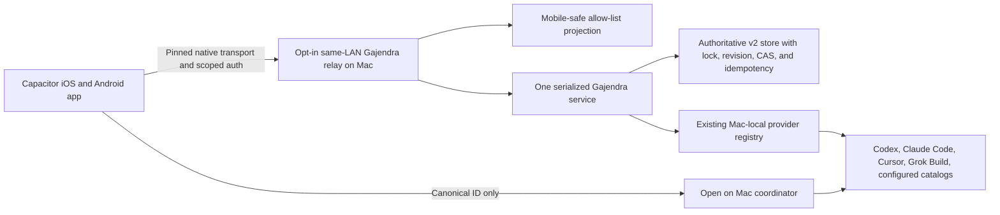
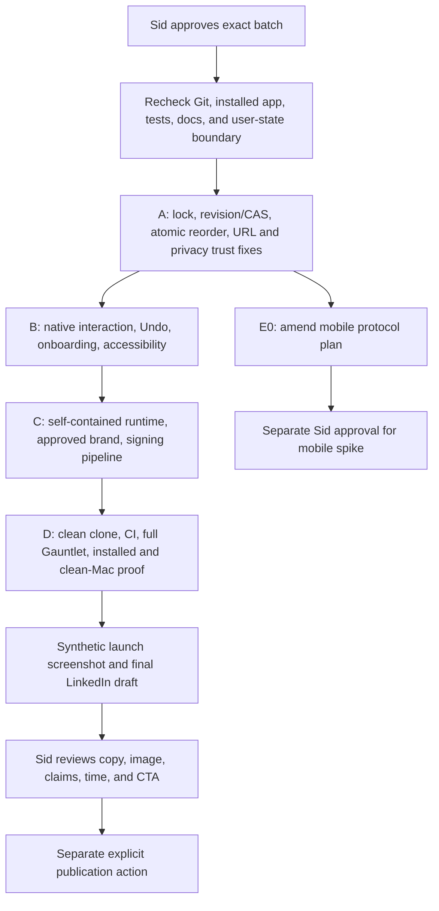

# Gajendra product, release, brand, mobile, and LinkedIn handoff

**State:** `handoff_ready_for_approval`

**Prepared:** 2026-08-17, Asia/Kolkata

**Repository:** `<repo-root>`

**Committed baseline:** `53e9855e8d19f90bb1d35e7432d5bc514e418f67` on `main`

**Remote baseline:** `origin/main` is the same commit. GitHub CI run
[31931702908](https://github.com/siddath/Gajendra/actions/runs/31931702908) passed for that commit.

**Approval owner:** Sid

**Purpose:** give a new Codex task enough verified context to repair and finish the current macOS
candidate, settle the release brand, amend the retained mobile plans, run the right proof, create a
synthetic launch image, and only then write a LinkedIn post about the experience and lessons.

This handoff is not implementation approval. It authorizes no merge, push, install, relaunch,
listener, signing, notarization, distribution, app-store action, or LinkedIn publication.

This is a local operator handoff, not public release documentation. It intentionally contains a
local repository path, installed-app path, process/build evidence, and host-specific hashes. Before
any public commit, run a privacy review and replace or remove machine-specific evidence that is not
needed in the public record.

## 1. Outcome, owner, and stopping condition

The next task should enable one owner decision: which repair and release batches Sid approves.

- Product, brand, publication, trust-boundary, and final visual approval: Sid.
- Desktop implementation and verification: the approved Codex task.
- Mobile orchestration after approval: Sol high, with Terra max and Luna max in bounded lanes.
- Deadline: none supplied. Set one when work resumes if a public announcement date matters.
- Stop before implementation when an unapproved product, privacy, distribution, or mobile trust
  choice is required.
- Stop after the approved batches are implemented and proven against a named build, or when a named
  kill criterion returns the work to planning.

Recommended approval sequence:

1. **A: Data integrity and trust**
2. **B: Native UX and onboarding**
3. **C: Distribution and brand**
4. **D: Proof, canon, launch image, and launch copy**
5. **E: Mobile plan amendment only**, followed by a separately approved phase-zero spike

Do not start mobile product implementation with A-D. Approve E first as a plan correction, then
approve its spike separately.

## 2. Truth labels used in this document

| Label | Meaning |
| --- | --- |
| Verified current | Rechecked against the repository, host, or installed binary on 2026-08-17 |
| Verified prior build | Proved for a named older build; later edits may have invalidated it |
| Local candidate | Present in the dirty worktree or installed locally; not committed or covered by hosted CI |
| Proposed | Recommended direction; not yet approved or implemented |
| External gate | Needs signing identity, clean machine, physical device, store, or another system outside this repo |
| Unknown | Evidence is absent or contradictory; do not convert it into a claim |

Keep these states separate in code, docs, release notes, and the LinkedIn post:

`local -> reviewed -> committed -> hosted CI -> installed -> signed -> notarized -> distributed -> public`

## 3. Current repository and installed-host snapshot

### 3.1 Git state

`main` and `origin/main` both point to `53e9855e8d19f90bb1d35e7432d5bc514e418f67`.
The committed baseline is public and its hosted CI is green. The current candidate is not clean:

```text
 M README.md
 M companion/macos/Sources/GajendraApp/main.swift
 M companion/macos/Sources/GajendraKit/DeckContentView.swift
 M companion/macos/Sources/GajendraKit/DeckWidgetView.swift
 M companion/macos/Sources/GajendraKit/Models.swift
 M companion/macos/Sources/GajendraPreview/main.swift
 M companion/macos/Sources/GajendraSelfTest/main.swift
 M companion/macos/scripts/render-preview.zsh
 M docs/ARCHITECTURE.md
 M docs/COMPANION.md
 M docs/COMPATIBILITY.md
 M docs/HOVER_CARD_DESIGN_CASE_STUDY.md
 M scripts/validate-companion.mjs
?? evidence/companion/gajendra-hover-card-queue-editing.png
?? worksheets/GAJENDRA_MOBILE_APP_PLAN.md
?? worksheets/gajendra-mobile/
?? worksheets/GAJENDRA_RELEASE_BRAND_MOBILE_HANDOFF.md
```

At the start of this handoff pass, the tracked candidate diff was 13 files, 714 insertions, and 93
deletions. During document validation, a separate local writer changed `DeckWidgetView.swift` and
`DeckContentView.swift` without an edit from this handoff task. The observed diff moved first to
754/93 and then to 858/99. Treat the checkout as actively changing, not as a frozen handoff
snapshot. Recheck and reconcile the concurrent work before editing, preserve every pre-existing
change, and never use a broad reset or checkout.

The mobile planning pack contains nine untracked Markdown files and about 1,260 lines. It is
retained locally, but not durable Git history until Sid approves staging and a later commit.

### 3.2 Installed app

- Running app: `~/Applications/Gajendra.app`
- Running PID observed on 2026-08-17: `54343`
- Installed and `build/` executable SHA-256:
  `7f97e1163ba6a7e3286abfcf7b9f839ed3cb2b4e628c8de173a9e548d7fe2e93`
- Executable size: `5,747,520` bytes
- Executable modification time: `2026-08-17 12:19:39 +0530`
- Ad-hoc code signature: valid on disk

The installed app matches the existing `build/` binary, but this is a dirty local candidate. The
later concurrent source edit means source-to-binary parity is no longer proved until a fresh
isolated build is reviewed. `STATUS.md` still records the older executable hash
`fb88dcb49a4b5e36b7f4307f8a5577039f2a7dfe8341a0ec4ffdaba532f50dd9`. Do not call the current
installed candidate the documented release until the candidate, evidence, status, and hosted
commit agree.

### 3.3 Current proof boundary

The 2026-08-17 adversarial pass observed:

- `npm --workspace gajendra run typecheck`: passed.
- `npm --workspace gajendra run test`: 30 of 30 passed.
- `npm run check:scripts`: passed.
- Isolated dirty Swift build and self-test: passed.
- `node scripts/validate-companion.mjs`: passed, but relies heavily on source/string checks and does
  not prove the installed interaction.
- `npm audit --omit=dev`: zero reported vulnerabilities.
- `git diff --check`: passed.
- Full dirty-tree `npm run gauntlet`: not run in the audit.
- Installed pointer, drag, cancellation, dismissal, large-text, and VoiceOver E2E for the dirty
  candidate: not complete.

During handoff validation, after the separate Swift edits appeared:

- `npm run check`: passed TypeScript, 30 tests, deterministic web/server builds, and plugin
  validation.
- `npm run companion:test`: passed the Swift self-test.
- `npm run companion:validate`: failed because the validator still requires the literal
  `Task.sleep(for: .milliseconds(450))`, while the changing source now uses a tuning constant. This
  is direct evidence that implementation and proof contract are out of sync. It was not caused by
  the handoff document.

The older release evidence in `STATUS.md` remains valid only for the named older build. Hosted CI
does not cover the uncommitted candidate.

## 4. Product intent and current user contract

Gajendra is a native, local-first focus layer over AI work. It is designed to reduce the cost of
remembering which thread matters now across several AI tools.

The daily habit should stay small:

1. Click the elephant-and-lotus mark.
2. See exactly one NOW thread.
3. See a short ordered Focus queue, a quieter Important queue, and explicit Running work.
4. Open the exact source thread.
5. Reorder priorities without copying the conversation into another task manager.

Non-negotiable domain rules:

- NOW is absent or exactly one thread, and it belongs to Focus.
- Thread IDs are namespaced by source.
- A thread cannot be in Focus and Important at the same time.
- Running is derived only from explicit provider activity. It is not a stored priority tier and is
  never inferred from recency or resumability.
- Context is an optional user-assigned `design`, `engineering`, or `life` enum only.
- Gajendra persists priority and source preferences, not prompts, transcripts, provider responses,
  tokens, credentials, or free-text context labels.
- Provider apps own their sessions. Gajendra resumes or opens them; it does not replace them or
  alter their native pinning.
- The floating macOS surface is an AppKit/SwiftUI utility, not a WidgetKit extension.

The current product surfaces include:

- native floating mark and click-presented focus card;
- singular NOW, Focus, Important, inclusive Running, and metadata search;
- full resizable Organizer;
- Compact, Comfortable, and Expanded card sizes;
- Native Popover and Focus Deck themes with Auto, Light, and Dark;
- Reduce Motion, keyboard commands, VoiceOver labels, context menus, and app-menu recovery;
- first-launch local source setup plus replay from Settings/menu;
- Codex, opt-in Claude Code, Cursor Agent, opt-in Grok Build, and bounded configured catalogs;
- inline MCP App and seven MCP tools;
- local source builds and an ad-hoc-signed macOS companion.

Current provider proof must stay honest:

| Provider | Current contract | Proof boundary |
| --- | --- | --- |
| Codex | Mac `codex app-server`, native thread open | Live on the tested Mac/build only |
| Claude Code | Opt-in bounded local JSONL metadata, structured Mac resume | Parser/local adapter proof; disclose the exact read boundary |
| Cursor | `cursor-agent ls` and structured resume | Fixture/contract until the CLI is installed and tested live |
| Grok Build | Opt-in bounded `summary.json`, structured Mac resume | Fixture/contract until live CLI proof exists |
| Configured agents | Explicit bounded catalog with reviewed destination | Operator-owned; never imply universal safety |

### Unresolved queue-limit wording

A prior product request said “maximum of five Focus and five Important,” while current canon says
five is guidance and the card shows five-row previews with Organizer overflow. Do not silently pick
one meaning.

Recommended interpretation: the focus card shows at most five queued rows per lane, while the
Organizer can hold the full ordered queues. If Sid instead wants a hard storage cap of five per
lane, change the domain policy, mutation errors, source/MCP/native/web UI, migration behavior, and
tests together.

## 5. Release verdict from the adversarial review

**Current verdict: no-go for a download-ready binary, download CTA, queue-edit merge, or mobile
implementation.**

The product concept and native direction are sound. The blockers are trust and proof, not a need
for another visual redesign. The most serious defect is silent cross-process data loss.

## 6. Required repair backlog

### A. Data integrity and trust

| ID | Severity | Gap and evidence | Required change | Exit proof |
| --- | --- | --- | --- | --- |
| A1 | P0 | `service.ts:25-28` performs read/apply/write; `store.ts:44-54` uses atomic rename without a lock or revision; `DeckClient.swift:37-43` starts a new Node process per call while stdio MCP can be another writer. An isolated 40-process mutation probe retained 7 entries and silently lost 33. | Create one serialized mutation path for every writer. Add an owner-private cross-process lock, monotonic revision, compare-and-swap using `expectedRevision`, idempotency keys, stale-writer rejection, and migration for old state. | Repeat the isolated independent-writer test and property sequences with zero silent loss. A stale write returns a typed conflict plus a fresh snapshot. Existing stdio/native/web behavior stays green. |
| A2 | P1 | Queue drops are plans of `setLevel` plus repeated `move` calls in `Models.swift:300-320`, then applied one by one by `moveDroppedQueueThread` in `DeckWidgetView.swift` and `moveDroppedThread` in `DeckContentView.swift`. A partial failure leaves a half-moved queue; a later call can clear the earlier error in `DeckViewModel.swift:42-60`. | Replace the multi-call plan with one atomic, idempotent `move-before` mutation carrying lane, target, expected revision, and idempotency key. Return one result and preserve errors until an explicit success/retry. | Same-lane, cross-lane, append, target-disappeared, stale-revision, duplicate-request, and process-crash tests prove all-or-nothing ordering. |
| A3 | P1 | `main.swift:825-829` registers `SMAppService.mainApp` whenever it is disabled. Turning Launch at Login off can be undone on the next launch. | Make Launch at Login default-off and user-controlled. Persist only the user's explicit choice and never auto-register after a disable. | Enable, disable, quit, relaunch, upgrade, and approval-required journeys on the final bundle. |
| A4 | P1 | `SECURITY.md` says Codex rollout JSONL is not inspected, while `codex-app-server.ts:159-187` and `238-249` read bounded rollout tails for runtime enrichment. `THREAD_SOURCES.md` is closer to the code. | Decide the boundary. Recommended: keep the bounded event-type enrichment only if Sid accepts it, document the exact lock and tail reads, prove no conversation content is emitted or persisted, and offer a kill switch. Otherwise remove enrichment. | Security, architecture, source docs, code, and tests say the same thing. Synthetic hostile tails prove only allowed activity signals affect Running. |
| A5 | P1 | The configured catalog schema accepts any Zod URL at `thread-sources.ts:593-603`; audit probes accepted `javascript:`, `data:`, and `file:`. Web fallback at `main.ts:618-633` and native open at `DeckViewModel.swift:68-74` trust the resulting URL. | Add per-source scheme allow-lists. Block `javascript:`, `data:`, and `file:` everywhere. Default configured sources to a narrow safe set; require explicit reviewed custom schemes. Validate again at the execution boundary. | Schema, web, native, and configured-source tests cover hostile schemes, encoded variants, mixed case, whitespace, and unknown custom schemes. |
| A6 | P1 | Server mutation schemas accept non-empty strings but do not prove IDs or source IDs exist. Unknown current IDs can persist and resolve to no thread. Store reads are unbounded; corrupted JSON has no quarantine or last-known-good recovery. | Validate targets against a current normalized snapshot where required. Bound reads from measured store size, quarantine corrupt state, preserve a private last-known-good copy, and expose a safe recovery path. | Unknown IDs/source IDs fail without mutation; oversize/corrupt/interrupted writes recover without silent reset or private-data leak. |

### B. Native UX and onboarding

| ID | Severity | Gap and evidence | Required change | Exit proof |
| --- | --- | --- | --- | --- |
| B1 | P1 | The queue press in `GajendraThreadRowButtonBody` has no movement threshold. During concurrent work its delay changed from the audited 450 ms literal to a 280 ms tuning constant, but movement still does not cancel it. A user beginning a drag or scrolling can enter edit mode accidentally. | Track pointer/touch movement and cancel stationary press beyond a small platform-derived tolerance. Cancel on view disappearance and competing gestures. | Installed pointer tests cover stationary hold, micro-movement, intentional drag, scroll start, release-before-threshold, Reduce Motion, and repeated entry/exit. |
| B2 | P1 | `queueDragPayload(thread.id)` still returns the raw canonical ID as a public `String` drag payload. | Use a private uniform type identifier or app-local transfer token. Resolve it inside the app and reject foreign payloads. | Drag works within and across lanes; copying/dropping into another app reveals no thread ID. |
| B3 | P1 | Edit mode can show up to ten red X controls and has no functional Undo registration. The app exposes an Undo menu, but mutations are not registered. | Add real undo/redo for remove, reorder, tier move, and context change. Reduce destructive visual noise and keep keyboard/context alternatives. | Installed Undo/Redo tests restore exact order/current/context after every supported mutation and after a failed/stale mutation. |
| B4 | P1 | Disabled controls remain visually active while a mutation is loading, which makes accepted versus unavailable action unclear. | Pair disabled state with clear visual and VoiceOver feedback. Prevent duplicate requests without making the interface appear frozen. | Slow-client and failure journeys show one accepted action, understandable busy state, and deterministic recovery. |
| B5 | P1 | `main.swift:150-154` marks onboarding complete when the red close button is used. Finish and Skip call the same completion path at `main.swift:882-885`. “Connect your AI tools” implies authentication/cloud connection even though the screen selects local metadata adapters. | Rename to **Choose your AI tools** and **Manage AI tools…**. Give Done/Finish, Not now, and window close explicit tested semantics. Add provider-specific setup guidance. Do not invent a reminder cadence without Sid's approval. | Clean install, existing-user upgrade, close, Not now, Done, missing-provider, error, replay, keyboard, and VoiceOver journeys prove the intended state transitions. |
| B6 | P1 | Large-font, long-provider/title, VoiceOver order, and installed queue-edit proof are incomplete. | Run native accessibility review on the installed candidate. Fix clipping, reading order, focus return, target naming, contrast, motion, and keyboard alternatives. | Installed evidence covers VoiceOver, keyboard-only, increased contrast, Reduce Motion, longest synthetic metadata, and supported display sizes. |

### C. Distribution and brand

| ID | Severity | Gap and evidence | Required change | Exit proof |
| --- | --- | --- | --- | --- |
| C1 | P1 | `DeckClient.swift:113-120` only finds Node through an override, `/opt/homebrew/bin/node`, or `/usr/local/bin/node`. The app bundles `server.mjs`, not Node. A downloaded app therefore fails on a clean Mac without Node. | Choose a self-contained runtime path. Short-term option: bundle and sign a pinned runtime plus notices. Larger option: replace the Node service with a native/embedded service. Keep source-install prerequisites separate from binary prerequisites. | Final signed app works on a clean supported Mac account with no Homebrew/Node. Bundle, license, update, signature, and Gatekeeper checks pass. |
| C2 | P1 | Public binary distribution is only ad-hoc signed. | After C1 and final tests, use Developer ID signing, notarization, stapling, checksum publication, and clean-machine Gatekeeper proof. | Named downloadable artifact passes `codesign`, `spctl`, notarization, install, launch, source discovery, login-item, and uninstall tests. |
| C3 | P1 | Current visible identity is split between Gaja and Gajendra, and the tagline “Elephant Focus for AI Power Users” leads with mascot and jargon instead of the user outcome. | Approve and apply the proposed brand system in section 7, while keeping compatibility identifiers stable. Run naming clearance before release. | All public/native/web/onboarding/menu/readme/store metadata follows one approved copy matrix; compatibility paths and upgrades remain intact. |

### D. Performance, diagnostics, proof, and canon

| ID | Severity | Gap and evidence | Required change | Exit proof |
| --- | --- | --- | --- | --- |
| D1 | P2 | Claude discovery stats every JSONL file before selecting 200 at `thread-sources.ts:245-264`. Grok slices workspace directories before sorting at `275-299`, so its newest-200 claim can be wrong. Every mutation also rebuilds a provider snapshot. | Select bounded candidates correctly, avoid unnecessary full scans, and separate priority mutations from provider refresh when safe. Measure before choosing caches or limits. | Large synthetic catalogs prove correct newest selection, bounded work, acceptable latency, and no active-thread eviction. |
| D2 | P2 | Raw configuration paths and provider stderr can reach errors. Temporary resume scripts are deleted only after 60 seconds at `DeckViewModel.swift:104-120`; app exit can leave residue, and an existing temp directory's permissions are not reasserted. | Sanitize diagnostics, cap provider stderr, reassert directory mode, clean stale scripts on startup/exit, and keep structured safe user errors. | Hostile stderr/path tests and interrupted-app inspection show no private path or durable script residue. |
| D3 | P1 | `docs/COMPATIBILITY.md` claims installed queue-interaction smoke while `docs/HOVER_CARD_DESIGN_CASE_STUDY.md` says it is still required. `docs/HOST_VALIDATION.md` still says hover opens the card. `docs/IMPLEMENTATION_PLAN.md` says the final Gauntlet is pending while `STATUS.md` says it passed. | Downgrade unsupported claims now, then reconcile all docs only after final evidence. | One clean status table names build hash, commit, proof type, providers, commands, and unresolved external gates without contradiction. |
| D4 | P1 | `scripts/validate-companion.mjs` proves source strings and bundle traits, not pointer behavior. macOS CI omits `companion:validate`. | Add the validator to CI and add behavior-level native tests where automation is possible. Keep an explicit installed-human receipt for interactions automation cannot prove. | Clean-clone CI plus installed receipts cover hover-no-open, click toggle, outside/Escape, hold/drag/cancel, Undo, onboarding, login item, open exact thread, and VoiceOver. |
| D5 | P2 | Copy varies between “Double-star Focus,” “Double-star focus,” and “Focus ✦✦.” | Use plain **Focus** everywhere unless Sid approves a different term. | Copy scan finds no retired term in public or runtime surfaces. |

## 7. Proposed release brand

### 7.1 Recommendation

Use one visible product name:

- **Visible name:** Gajendra
- **Descriptor:** One clear focus across your AI tools.
- **Category:** A native, local-first focus layer for AI work.
- **Product promise:** One NOW. One short queue. One click back to the exact thread.
- **Mark story:** the elephant represents steady attention; the lotus represents clarity. Keep this
  as the visual story, not the headline.
- **Technical compatibility identity:** keep `gajendra` package IDs, bundle identifiers, executable,
  URL scheme, state directory, plugin ID, and migration paths stable.

The working copy should explain the benefit first. Retire **Elephant Focus for AI Power Users**
before the first binary release. It is mascot-first, narrows the audience with jargon, and does not
say what the app changes for the user.

### 7.2 Copy matrix

| Surface | Proposed copy |
| --- | --- |
| App/window/header name | Gajendra |
| Header descriptor | One clear focus across your AI tools. |
| README opening | Gajendra is a native, local-first focus layer for AI work across Codex, Claude Code, Cursor, Grok Build, and configured local tools. |
| Short promise | One NOW. One short queue. One click back to the exact thread. |
| First launch title | Choose your AI tools |
| First launch body | Select the supported local tools Gajendra should read for thread metadata. No sign-in or cloud sync. |
| Settings/menu action | Manage AI tools… |
| Resume action | Open thread |
| Mobile resume action | Open on Mac |
| Queue labels | NOW, Focus, Important, Running |
| Public category | Native macOS focus utility, not a WidgetKit extension |

Avoid these launch phrases:

- “AI-powered productivity”
- “revolutionary” or “game-changing”
- “seamlessly unifies everything”
- “works with every AI tool”
- “secure” without naming the control and proof
- “private” when the exact local metadata read is not disclosed
- “download now” before the self-contained signed binary gate

### 7.3 Naming clearance gate

This is a product recommendation, not legal clearance. A quick 2026-08-17 scan found adjacent uses
of Gaja/Gajendra, including [Gaja AI/SuperBased](https://superbased.app/privacy), a
[GAJA finance app](https://apps.apple.com/my/app/gaja/id1609921294), and a Bhabha AI model named
[Gajendra](https://www.linkedin.com/posts/bhabhaai_introducing-gajendra-an-early-release-of-activity-7158733769925959681-Z-aM).

Before the first binary release:

1. Search Indian and target-market trademarks with a qualified owner.
2. Search App Store, Play Store, GitHub, package registries, domains, and major social handles.
3. Decide whether discoverability risk is acceptable.
4. Freeze the visible name once. Do not add another casual rename while preserving hidden old copy.

If clearance rejects Gajendra as the visible name, retain the compatibility identity and run a
separate naming decision. Do not fall back to the current Gaja/Gajendra split by accident.

## 8. First-use and retention design

The product should earn a daily place by reducing one repeated decision, not by adding a dashboard.

### First use

1. Explain that Gajendra reads local metadata, not accounts or conversations.
2. Show supported tools with Ready, Off, Not installed, Needs setup, or Needs attention.
3. Let the user choose sources with honest immediate or staged-save semantics.
4. Show one sentence on the habit: choose one NOW, keep Focus short, open the original thread.
5. Finish on the actual focus card, not a success confetti screen.

### Daily retention loop

- The mark stays quiet until clicked.
- NOW remains singular and centered.
- Focus and Important counts stay adjacent to their labels.
- Full-row open, search, and Organizer recovery minimize hunting.
- Reorder and Undo make maintenance safe.
- Launch at Login is opt-in, not a growth trick.
- Running shows only explicit live work and never fabricates urgency.

The adoption test remains reversible: three deliberate returns over 14 days, including one NOW
change that alters the next opened thread and use across at least two source apps. Record real
receipts. Kill or revise the utility if it becomes visual noise, opens without deliberate action,
shows materially stale metadata, resumes unreliably, or duplicates queue upkeep.

## 9. Mobile plan to retain and amend

The retained planning pack starts at
[GAJENDRA_MOBILE_APP_PLAN.md](GAJENDRA_MOBILE_APP_PLAN.md) and
[gajendra-mobile/README.md](gajendra-mobile/README.md). Its stable direction is correct:



The phone is a paired focus client. It is not a provider client, remote terminal, cloud replica,
or second priority authority.

### 9.1 Stable mobile choices

- One opt-in Mac-hosted Streamable HTTP MCP relay, not one MCP per provider.
- Same LAN only for v1; no public Internet or cloud relay.
- Provider credentials, discovery, session files, source enablement, and execution remain on Mac.
- Mobile receives a versioned allow-list DTO with no `resumeCommand`, executable, arguments,
  absolute `cwd`, provider response, arbitrary URL, token, or credential.
- Mobile sends a canonical ID only for the separately scoped **Open on Mac** action.
- No offline thread snapshot, second priority store, background sync, notifications, or widgets in
  v1.
- Existing stdio MCP, inline MCP App, and macOS app must remain green.
- Run a bounded Capacitor v8 spike. A native Swift/Kotlin plugin exclusively owns TLS pinning,
  authorization, Keychain/Keystore, local-network permissions, secure storage, and relay traffic.
- If the spike fails any security, accessibility, lifecycle, or native-test gate, stop. Re-estimate
  and seek approval for the predefined SwiftUI plus Jetpack Compose fallback.

### 9.2 Required plan amendment before code

The plan has the right boundaries but does not yet freeze enough protocol detail. Add an E0
amendment that names:

1. Authorization-server ownership and lifecycle.
2. Client registration and exact pairing/bootstrap flow.
3. Redirect/callback ownership and proof-of-possession.
4. Access and refresh credential lifetimes, rotation, reuse detection, revoke, and lost-device flow.
5. Certificate/SPKI rotation and re-pair behavior.
6. mDNS, IP change, Wi-Fi change, sleep/wake, and network-transition handling.
7. Listener interface, Host, Origin, request metadata, protocol-version, body, rate, timeout, and
   connection validation.
8. Stale desktop writer shutdown and single-authority activation.
9. WebView content security policy, navigation allow-list, external-link handling, and proof that
   JavaScript cannot call the relay directly.
10. Sanitized error, logging, backup, app-switcher, screenshot, and evidence rules.

Recheck current official MCP, iOS, Android, and Capacitor primary documentation at implementation
time. The retained plan currently targets MCP `2026-07-28`:

- [MCP Streamable HTTP](https://modelcontextprotocol.io/specification/2026-07-28/basic/transports/streamable-http)
- [MCP authorization](https://modelcontextprotocol.io/specification/2026-07-28/basic/authorization)
- [Apple local network privacy](https://developer.apple.com/documentation/technotes/tn3179-understanding-local-network-privacy)
- [Android local network permission](https://developer.android.com/privacy-and-security/local-network-permission)
- [Capacitor](https://capacitorjs.com/docs)

### 9.3 Pending mobile approvals

The decision register is
[gajendra-mobile/DECISIONS_RISKS_APPROVALS.md](gajendra-mobile/DECISIONS_RISKS_APPROVALS.md).
Sid must explicitly decide:

- D01: same-LAN opt-in relay and privacy/security amendment;
- D02: Open on Mac as the only v1 resume behavior;
- D03: Capacitor v8 plus native transport spike;
- D05: supported iOS and Android targets from current evidence;
- D06: v1 distribution scope, with local/internal physical proof recommended first;
- D07: one iPhone, one Android phone, and an approved safe LAN;
- D11 later: merge, release, publication, and app stores.

Cloud access, phone provider credentials/source enablement, offline cache, background features, and
store release remain rejected or deferred for v1.

### 9.4 Current mobile blockers

Observed on 2026-08-17; recheck on resume:

- Full Xcode, CoreSimulator, and `simctl`: absent.
- Android Studio, SDK, `adb`, emulator, `sdkmanager`, and Gradle: absent.
- Swift 6.3.2, Node 26.3.0, npm 11.16.0, and Java 25.0.4 are present, but do not prove iOS or
  Android builds.
- Java 25 compatibility with the chosen Android Gradle Plugin is unknown.
- No physical iPhone or Android paired-LAN UAT exists.
- No mobile listener, app, credentials, dependencies, or branch have been created.

### 9.5 Requested Codex agent method

Exact requested models were available and produced useful read-only work on 2026-08-17:

| Role | Model/effort | Lane |
| --- | --- | --- |
| Orchestrator/integration | `gpt-5.6-sol`, high | contracts, sequencing, Mac integration, review, Gauntlet, final docs |
| Security/server worker | `gpt-5.6-terra`, max | store concurrency, projection, relay/auth/threat tests |
| Mobile UI/toolchain worker | `gpt-5.6-luna`, max | parity, Capacitor/native transport spike, iOS/Android UI/test lane |

Reconfirm availability when implementation resumes. Keep one writer per file. Land shared
contracts and store safety before consumers. Do not let workers edit the same artifact in parallel.
The root task retains approval and synthesis responsibility.

The Sid AI Harness was used as advisory standards during planning, but Gajendra was not registered
as an owning Harness project at that time. Live Gajendra repo canon remains authoritative. In a new
task, begin with a prompt starting `Codex Harness:` so the required preparation route actually runs.

## 10. Implementation and proof flow



### 10.1 Safe implementation order

1. Recheck the dirty tree and make an explicit ownership map.
2. Preserve and back up real state. Use temporary `GAJENDRA_DATA_DIR` and isolated preferences for
   development and stress tests.
3. Write failing tests for A1-A6 before changing the mutation authority.
4. Land the store/revision/mutation contract, then migrate all writers.
5. Repair native UX and onboarding against the frozen contract.
6. Approve and apply the copy/name matrix without renaming compatibility surfaces.
7. Choose and implement the self-contained binary runtime.
8. Reconcile docs only to the evidence of the named candidate.
9. Run clean-clone and hosted checks.
10. Install the exact candidate only with the proper user-state and rollback boundary.
11. Run installed interaction, accessibility, login-item, and clean-Mac distribution proof.
12. Create the synthetic launch image, then the post. Sid reviews both before publication.

Do not commit, push, merge, install, relaunch, sign, distribute, or publish merely because tests
pass. Each action needs its own authority when it changes external or user state.

### 10.2 Desktop Gauntlet expectations

Minimum command spine after the relevant fixes:

```bash
npm ci
npm run check
npm run companion:test
npm run companion:build
npm run companion:validate
npm run test:e2e
npm run gauntlet
npm audit --omit=dev
git diff --check
```

Add focused gates for:

- multi-process no-loss mutation stress;
- revision/CAS/idempotency property sequences;
- atomic queue move and Undo;
- hostile URL, ID, source, JSON, text, stderr, and resume inputs;
- privacy projection and persistence scans;
- launch-at-login opt-in/relaunch behavior;
- onboarding close/Not now/Done semantics;
- pointer hold/movement/drag/drop/outside/Escape behavior;
- private drag payload;
- long text, keyboard, VoiceOver, Reduce Motion, and increased contrast;
- provider selection correctness and bounded scan performance;
- installed binary/service/source hash parity;
- clean-account runtime without Node/Homebrew;
- Developer ID, notarization, stapling, Gatekeeper, uninstall, and checksums for a downloadable
  artifact.

The Gauntlet must fail closed when a required toolchain or receipt is missing. Source-string checks,
rendered previews, simulator screenshots, and fixtures have narrower proof labels than installed
behavior.

### 10.3 Mobile Gauntlet expectations

Use the retained
[test plan](gajendra-mobile/TEST_GAUNTLET_PLAN.md). The additive gates must cover safe DTOs,
store concurrency, MCP transport, auth/pair/revoke, native-only transport, iOS, Android, repeated
reconnect/conflict journeys, evidence privacy, one physical iPhone and Android, then the unchanged
desktop Gauntlet.

No simulator or emulator receipt can replace physical local-network, permission, secure-storage,
or paired-LAN proof.

## 11. Synthetic screenshot brief for launch

Do not use `evidence/companion/gajendra-hover-card-queue-editing.png` as the launch image. It is a
developer-state screenshot with many red remove controls and release-oriented dummy tasks. It does
not show the calm daily value of the product.

Create a new image only after brand and UX fixes are approved. Suggested target:

`evidence/launch/gajendra-linkedin-synthetic.png`

Creative direction:

- native macOS context is visible, but the focus card remains the hero;
- light Native Popover theme for feed legibility, with a dark alternative for review;
- normal daily mode, not edit mode;
- approved **Gajendra** name and descriptor;
- exactly one strong NOW, three to five believable cross-provider queue items, and a small Running
  section;
- no current thread IDs, titles, projects, paths, user names, private data, or real provider state;
- label the asset or caption as **Synthetic demo data**;
- preserve the real layout, typography, spacing, themes, provider badges, and native materials;
- review at feed size so title, NOW, provider, and primary Open action remain readable.

Suggested synthetic data:

| Placement | Title | Project | Provider/status |
| --- | --- | --- | --- |
| NOW | Fix the first-run setup | Gajendra release | Codex, Running |
| Focus | Validate a clean Mac install | Release readiness | Claude Code, Ready |
| Focus | Test keyboard and VoiceOver | Accessibility | Codex, Running |
| Focus | Review local-first privacy copy | Product trust | Cursor, Ready |
| Important | Plan the mobile pairing spike | Mobile companion | Grok Build, Ready |
| Important | Draft release notes | Launch | Claude Code, Ready |

The screenshot should communicate this in one glance: one decision now, a short queue behind it,
and a direct return to the owning AI tool.

## 12. LinkedIn post handoff

Write the final post only after implementation and proof. The post is about a small side project,
the native product choices, the bugs found when treating it like a real product, and what Sid
learned. It is not a feature dump or a fake launch victory.

### 12.1 Story arc

1. **Hook:** the personal problem of losing the one AI thread that actually needed attention across
   several tools.
2. **Why a side project:** existing tools owned sessions, but none owned Sid's one cross-tool
   decision about what to open next.
3. **What he built:** one NOW, a short Focus queue, Important, explicit Running, search, and exact
   return to the source thread.
4. **Why native macOS:** a quiet click-presented surface, system materials, keyboard and VoiceOver,
   Reduce Motion, compact density, and no generic dashboard.
5. **What the hard review taught:** atomic file replacement was not concurrency safety; attractive
   drag-and-drop was not safe if it produced several writes; local-first claims had to match every
   metadata read; a downloadable app had to bring its own runtime.
6. **What changed:** name the fixes only after they are proved on the final build.
7. **Next steps:** paired iOS/Android companion through one opt-in Mac relay, Open on Mac, physical
   device testing, and honest provider proof. Do not imply it already exists.
8. **CTA:** invite testers or source contributors. Use a download CTA only after the signed,
   notarized, self-contained clean-Mac gate.

### 12.2 Voice and anti-slop rules

- First person, plain language, short paragraphs, and concrete details.
- Sound like Sid describing a real irritation and the engineering choices he made.
- Use three to five functional emojis at section turns, not on every sentence.
- Keep one memorable line: **One NOW. One short queue. One click back to the exact thread.**
- Mention “small side project” once, naturally.
- Prefer specific lessons over “excited to announce,” “thrilled,” or “journey.”
- No fake vulnerability, grand mission, founder cosplay, rhetorical question stack, or engagement
  bait.
- No “what is proven today” section. Frame unfinished work naturally as next steps.
- Do not claim adoption, retention, impact, privacy, support, download readiness, iOS/Android, or
  provider compatibility beyond named evidence.
- Use **I built** for work Sid owns and **I used Codex Harness plus bounded model lanes** only when
  the post explains how the method affected quality. Do not turn model names into the hook.
- Run a final privacy, claim, brand, spelling, and synthetic-image review before Sid approves it.

The exact prior LifeOS announcement was not found in the surfaced task history or memory registry.
Do not claim the final draft matched it. In the new task, ask Sid for the post text/link or use the
verified voice pattern above.

### 12.3 Timing and publication gate

Do not hard-code a “best time” now. Posting performance and Sid's audience activity can change.
On the actual publication day:

1. Check current LinkedIn guidance and Sid's own audience/profile analytics if available.
2. Choose a time when Sid can reply personally for the next 30 to 60 minutes.
3. Prefer the account's observed audience activity over generic benchmark articles.
4. If no account evidence exists, treat the time as an experiment and record the result.
5. Sid must approve the final text, image, link/CTA, privacy claims, and posting time.

No automation should publish or engage on Sid's behalf without exact authorization.

## 13. Claims that should be rejected unless new evidence appears

- Atomic rename prevents cross-process lost updates.
- The current installed candidate is covered by hosted CI.
- `companion:validate` proves pointer, drag, VoiceOver, or onboarding behavior.
- Gajendra is a WidgetKit widget.
- Gajendra changes provider-native pins or owns provider sessions.
- Cursor or Grok is live-proven on this host without the actual CLI receipt.
- The public app is self-contained, Developer ID signed, notarized, or download-ready.
- A responsive WebView or simulator proves a secure mobile companion.
- A fixture proves provider resume.
- “Accepted Open on Mac” proves the provider restored the session.
- The Gajendra visible name is legally cleared.
- The mobile plan authorizes a LAN listener or product implementation.

Rejected audit false positives worth preserving:

- The current Gaja/Gajendra split is intentional in existing canon; the defect is release clarity
  and discoverability, not an accidental code rename.
- There is no LAN listener today. Mobile adds that future boundary.
- No queue-planner arithmetic defect was proved in the inspected permutations; the proved problem
  is multi-call non-atomicity.
- Web E2E exists. The missing proof is installed native behavior.
- Cursor and Grok fixture/live limits are mostly stated honestly, though status coverage can be
  clearer.

## 14. Approval checklist for Sid

Before editing, ask Sid to confirm each item separately:

- [ ] A1-A6: data integrity and trust repairs.
- [ ] B1-B6: native UX, onboarding, Undo, and accessibility repairs.
- [ ] C1-C2: self-contained binary and later Apple distribution work.
- [ ] C3: proposed visible **Gajendra** brand and copy matrix, subject to clearance.
- [ ] Queue interpretation: five visible rows per card lane versus a hard five-item stored cap.
- [ ] Privacy choice: retain and disclose bounded Codex activity enrichment, or remove it.
- [ ] D1-D5: performance, diagnostics, proof, CI, docs, and copy reconciliation.
- [ ] E0 only: amend the mobile protocol plan.
- [ ] Later E spike: same-LAN relay, Open on Mac, Capacitor/native transport, targets, devices, LAN,
  and internal-only distribution scope.
- [ ] Later launch: synthetic screenshot and LinkedIn draft review.
- [ ] Separate final actions: commit, push, merge, install/relaunch, sign/notarize/distribute, and
  publish.

## 15. Paste-ready prompt for the next Codex task

```text
Codex Harness: Resume the Gajendra product and release work from
`worksheets/GAJENDRA_RELEASE_BRAND_MOBILE_HANDOFF.md`.

First read the repository AGENTS.md and the handoff completely, then recheck current Git status,
HEAD/origin, installed app/hash/process, current tests, mobile toolchains, and all truth drift. The
worktree was dirty and must be preserved. Treat live repo canon as authoritative if it differs from
the handoff.

Present the A-D approval batches, the two queue/privacy decisions, and E0 mobile plan amendment for
my confirmation. Do not implement until I approve exact batches. Do not commit, push, merge,
install, relaunch, sign, distribute, enable a listener, or publish without the matching approval.

After approval, implement one batch at a time using isolated state, test observable behavior, and
run the Codex Harness plus Gauntlet method. For mobile delegation, reconfirm and use gpt-5.6-sol high
as orchestrator, gpt-5.6-terra max for the bounded security/server lane, and gpt-5.6-luna max for the
bounded mobile UI/toolchain lane. Keep one writer per file and land shared contracts first.

Only after the named desktop build is clean, self-contained, behaviorally verified, and honestly
documented should you create the synthetic LinkedIn screenshot and draft the post. I retain final
brand, image, copy, timing, CTA, release, and publication approval.
```

## 16. Source map for the next task

Read these before the corresponding work:

- Product/release canon: `README.md`, `STATUS.md`, `SECURITY.md`, `AGENTS.md`
- Architecture/source boundaries: `docs/ARCHITECTURE.md`, `docs/THREAD_SOURCES.md`,
  `docs/COMPATIBILITY.md`
- Native UX: `docs/DESIGN_SYSTEM.md`, `docs/APPLE_DESIGN_COMPLIANCE.md`,
  `docs/HOVER_CARD_DESIGN_CASE_STUDY.md`, `docs/COMPANION.md`
- Proof/release: `docs/GAUNTLET.md`, `docs/HOST_VALIDATION.md`, `docs/RELEASE_CHECKLIST.md`,
  `docs/ENGINEERING_AUDIT.md`, `docs/DEVEX_REVIEW.md`
- Store/service: `plugins/gajendra/src/server/store.ts`, `service.ts`, `domain.ts`
- Providers/security: `thread-sources.ts`, `codex-app-server.ts`, `plugins/gajendra/src/shared/contracts.ts`
- Web open boundary: `plugins/gajendra/src/ui/main.ts`
- Native client/state/open: `DeckClient.swift`, `DeckViewModel.swift`, `Models.swift`
- Native card/organizer/onboarding: `DeckWidgetView.swift`, `DeckContentView.swift`,
  `SourceOnboardingView.swift`, `GajendraApp/main.swift`
- Mobile authority: `worksheets/GAJENDRA_MOBILE_APP_PLAN.md` and every file under
  `worksheets/gajendra-mobile/`

## 17. Handoff completion condition

This handoff is complete when:

- it remains a single readable entry point for a new task;
- its links resolve;
- current, prior, proposed, and external states are not mixed;
- all adversarial findings, brand choices, mobile gates, screenshot requirements, and LinkedIn
  constraints are represented;
- the repository has no product changes caused by writing this document;
- Sid can paste section 15 into another task and receive an approval-gated continuation.
